# Istio监控功能

## **prometheus和grafana**

* Prometheus存储服务的监控数据，数据来自于istio组件mixer上报
* Grafana开源数据可视化工具，展示Prometheus收集到的监控数据

> istio已经默认帮我们把grafana和prometheus已经默认部署好了

（1）执行命令查看istio自带的组件

```sh
kubectl get pods -n istio-ns
```

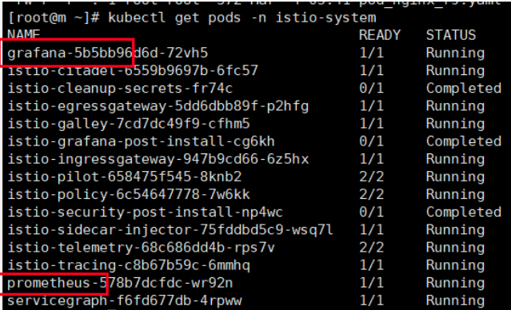

>我们打开istio-demo.yaml文件找到找到prometheus和grafana
>
>
>
>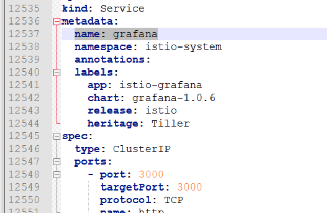
>
>>其实istio已经默认帮我们安装好了grafana和prometheus,只是对应的Service类型是clusterIP类型,表示集群内部可以访问，如果我们需要能够通过浏览器访问，我们只需要ingress访问规则即可，ingress之前已经介绍过了，这边就不在重复了
>
>* 配置prometheus-ingress.yaml和grafana-ingress.yaml配置文件
>
>**prometheus-ingress.yaml**
>
>~~~yaml
>#ingress
>apiVersion: extensions/v1beta1
>kind: Ingress
>metadata:
>name: prometheus-ingress
>namespace: istio-system
>spec:
>rules:
> - host: prometheus.istio.qy.com
>http:
> paths:
>     - path: /
>   backend:
>     serviceName: prometheus
>     servicePort: 9090
>
>
>~~~
>
>> * 执行命令
>>
>> ~~~sh
>> kubectl apply -f prometheus-ingress.yaml和grafana-ingress.yaml
>> ~~~
>
>**grafana-ingress.yaml**
>
>~~~yaml
>#ingress
>apiVersion: extensions/v1beta1
>kind: Ingress
>metadata:
>name: grafana-ingress
>namespace: istio-system
>spec:
>rules:
> - host: grafana.istio.qy.com
>http:
> paths:
>     - path: /
>   backend:
>     serviceName: grafana
>     servicePort: 3000
>~                              
>~~~
>
>>* 执行命令
>>
>>~~~sh
>>kubectl get ingress -n istio-system
>>~~~
>
>**配置prometheus访问域名**
>
>> 在hosts文件里面增加ip域名的映射关系
>>
>> ~~~
>> 192.168.187.137    prometheus.istio.qy.com
>> ~~~
>
>**配置grafana访问域名**
>
>>在hosts文件里面增加ip域名的映射关系
>>
>>~~~
>>192.168.187.137    grafana.istio.qy.com
>>~~~
>>
>>

### 访问prometheus

>浏览器输入地址：prometheus.istio.qy.com
>
>

### 访问grafana

* 设置prometheus地址

>找到prometheus在k8s里面服务地址
>
>**命令**
>
>~~~sh
>kubectl get svc -o wide -n istio-system
>~~~
>
>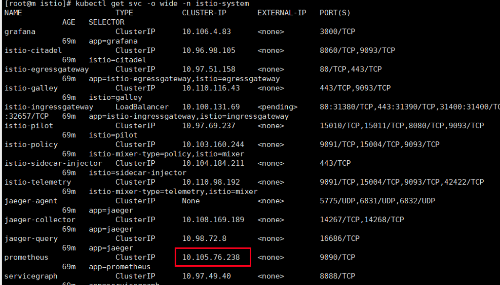

> 选择DataSources

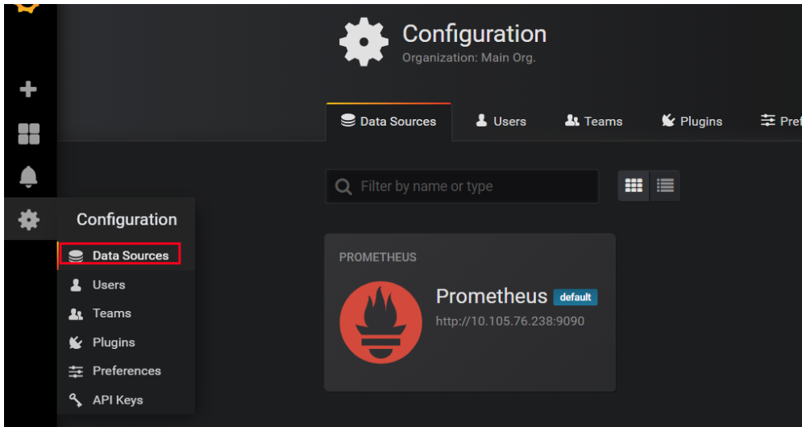

> 选择settings ，把url改成prometheus即可

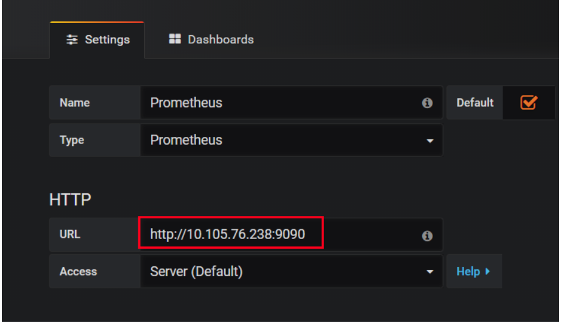

# 项目案例：bookinfo

## 理解什么是bookinfo 

~~~
这是istio官方给我们提供的案例，Bookinfo 应用中的几个微服务是由不同的语言编写的。 这些服务对 Istio 并无依赖，但是构成了一个有代表性的服务网格的例子：它由多个服务、多个语言构成，并且 `reviews` 服务具有多个版本。
~~~

下图展示了这个应用的端到端架构。

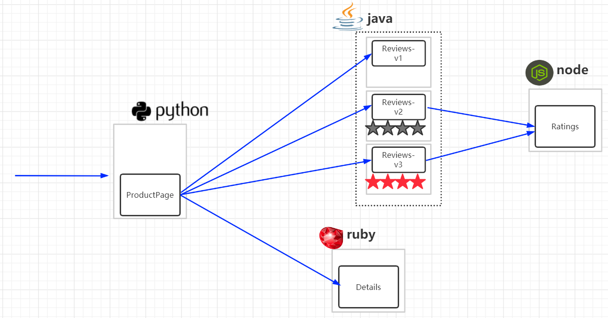

这个案例部署了一个用于演示Istio 特性的应用，该应用由四个单独的微服务构成。 这个应用模仿在线书店的一个分类，显示一本书的信息。 页面上会显示一本书的描述，书籍的细节（ISBN、页数等），以及关于这本书的一些评论。

Bookinfo 应用分为四个单独的微服务：

- `productpage`. 这个微服务会调用 `details` 和 `reviews` 两个微服务，用来生成页面。
- `details`. 这个微服务中包含了书籍的信息。
- `reviews`. 这个微服务中包含了书籍相关的评论。它还会调用 `ratings` 微服务。
- `ratings`. 这个微服务中包含了由书籍评价组成的评级信息。

`reviews` 微服务有 3 个版本：

- v1 版本不会调用 `ratings` 服务。
- v2 版本会调用 `ratings` 服务，并使用 1 到 4个黑色星形图标来显示评分信息。
- v3 版本会调用 `ratings` 服务，并使用 1 到 4个红色星形图标来显示评分信息。

>大家一定要从spring cloud思维模式里面跳出来，站着服务网格的立场上思考问题，我们是不需要了解服务的业务代码是什么样的，业务的服务只需要交给istio管理即可
>
>所以大家一定要有一颗拥抱变化的心

## sidecar自动注入到微服务

> 所以第一步我们需要给每一个服务配置一个Sidecar,但是配置sidecar我们前面也说过，可以有两种方式实现，一种是手动注入，一种是自动注入，如果自动注入需要与命名空间相关，需要准备一个命名空间
>
> * 查看命名空间：
>
> ~~~
> kubectl get ns
> ~~~
>
> 这个时候我们需要创建一个命名空间，需要打上一个lable表示只要是在这个lable的命名空间里面的都自动注入
>
> * 创建命名空间命令：
>
> ~~~
> kubectl create namespace bookinfo-ns
> ~~~
>
> * 给命名空间加上label命令
>
> ~~~
> kubectl label namespace bookinfo-ns istio-injection=enabled
> ~~~
>
> * 查看命名空间下有哪些label命
>
> ~~~
> kubectl get ns bookinfo-ns --show-labels
> ~~~

## 启动bookinfo

> 进入istio安装目录：/home/tools/istio-1.0.6/samples/bookinfo/platform/kube
>
> 找到bookinfo.yaml文件
>
> 查看需要的image个数：
>
> ~~~sh
> cat bookinfo.yaml | grep image：
> ~~~
>
> 
>
> > 里面就是bookinfo案例所需要依赖的镜像地址
>
> * 执行命令
>
> ~~~sh
> kubectl apply -f  bookinfo.yaml -n bookinfo-ns
> ~~~
>
> * 查看pod情况
>
> ~~~sh
> kubectl get pods -n bookinfo-ns
> # 会发现有两个container,有两个container的原因是因为我们有自动注入，这边有六个服务，其实只要四个服务，有一个服务有三个版本仅此而已
> ~~~
>
> 
>
> * 查看pod明细
>
> ~~~sh
> kubectl describe pods pod名字 -n bookinfo-ns
> # 例如：kubectl describe pods reviews-v1-fd6c96c74-cmqcx -n bookinfo-ns
> ~~~
>
> >会发现有两个container,一个是我们自己的container,另外一个是自动注入的代理container
>
> * 检查一下service
>
> ~~~sh
> kubectl get svc -n bookinfo-ns
> ~~~
>
> 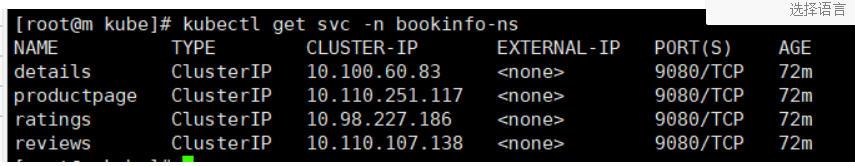
>
> > 可以看到service的类似clusterip类型
>
> * 验证Bookinfo 应用是否正在运行
>
> >请在某个 Pod 中用 `curl` 命令对应用发送请求，例如 `ratings`
> >
> >* 执行命令
> >
> >~~~sh
> >    kubectl exec -it $(kubectl get pod -l app=ratings -n bookinfo-ns -o jsonpath='{.items[0].metadata.name}') -c ratings -n bookinfo-ns -- curl productpage:9080/productpage | grep -o "<title>.*</title>"
> >~~~
> >
> >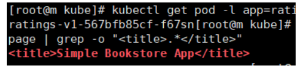
> >
> >> 看到如图所示表示bookinfo启动成功
> >
> >命令分析一下
> >
> >~~~sh
> >kubectl get pod -l app=ratings -n bookinfo-ns -o jsonpath='{.items[0].metadata.name}';表示的是输出ratings 这个运行时pod的名字
> >~~~
> >
> >~~~sh
> >kubectl exec -it $(kubectl get pod -l app=ratings -n bookinfo-ns -o jsonpath='{.items[0].metadata.name}') -c ratings -n bookinfo-ns -- curl productpage:9080/productpage | grep -o "<title>.*</title>"：进入到ratings内部，然后发送一个http测试，根据响应结果找到title标签
> >~~~
> >
> >
>
> >思考：能否通过页面的方法访问bookinfo项目呢
> >
> >所以下面我们用ingress方式访问bookinfo

## 通过ingress方式访问

>* 找到productpage-service服务的端口，打开bookInfo.yaml文件
>
>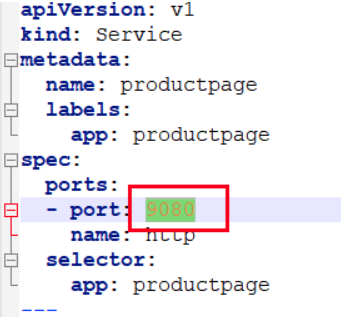
>
>>需要给productpage暴露的9080端口进行ingress域名绑定
>
>* 新建productpageIngress.yaml
>
>~~~yaml
>#ingress
>apiVersion: extensions/v1beta1
>kind: Ingress
>metadata:
>  name: productpage-ingress
>spec:
>  rules:
>  - host: productpage.istio.qy.com
>    http:
>      paths:
>      - path: /
>        backend:
>          serviceName: productpage
>          servicePort: 9080
>~~~
>
>- 查询productpage这个pod分布在那台服务上，执行命令
>
>```sh
>kubectl get pods -o wide -n bookinfo-ns
>```
>
>
>
>> 服务发现在w1机器上
>
>* 配置hosts文件
>
>~~~
>192.168.187.137    productpage.istio.qy.com
>~~~
>
>* 执行命令
>
>~~~
>kubectl apply -f productpageIngress.yaml -n bookinfo-ns
>~~~
>
>* 访问地址：productpage.istio.qy.com
>
>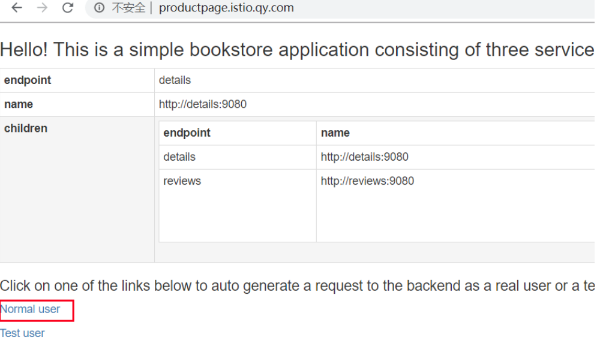
>
>> 点击Normal user,查看书籍相关的评论
>
>
>
>> 不停的刷新会有三个Reviews版本一个是不带星的一个是带黑色星的一个是带红星的，跟架构图一样的

## 通过istio的ingressgateway访问

### 确定 Ingress 的 IP 和端口

>现在 Bookinfo 服务启动并运行中，需要使应用程序可以从外部访问 Kubernetes 集群，例如使用浏览器。可以用Istio Gateway来实现这个目标。
>
>* 为应用程序定义 Ingress 网关
>
>> 地址：/home/tools/istio-1.0.6/samples/bookinfo/networking有一个bookinfo-gateway.yaml
>
>~~~sh
>kubectl apply -f bookinfo-gateway.yaml -n bookinfo-ns
>~~~
>
>* 查看gateway
>
>~~~sh
>kubectl get gateway -n bookinfo-ns
>~~~
>
>> 有了gateway之后我们需要配置一些环境变量
>>
>> **配置gateway ip环境**
>>
>> ~~~sh
>> export INGRESS_HOST=$(kubectl get po -l istio=ingressgateway -n istio-system -o jsonpath='{.items[0].status.hostIP}')
>> # 把ingressgateway的ip设置成环境变量
>> ~~~
>>
>> > 分析命令意思
>> >
>> > ~~~sh
>> > kubectl get po -l istio=ingressgateway -n istio-system -o jsonpath='{.items[0].status.hostIP}'
>> > # 表示获取istio组件ingressgateway组件的ip
>> > ~~~
>> >
>> > 
>> >
>> > 也就是说192.168.187.137就是ingressgateway组件的ip
>>
>> **配置gateway端口**
>>
>> ~~~sh
>> export INGRESS_PORT=$(kubectl -n istio-system get service istio-ingressgateway -o jsonpath='{.spec.ports[?(@.name=="http2")].nodePort}')
>> ~~~
>>
>> 把ingressgateway的端口设置成环境变量
>>
>> >分析命令意思
>> >
>> >~~~sh
>> >kubectl -n istio-system get service istio-ingressgateway -o jsonpath='{.spec.ports[?(@.name=="http2")].nodePort}'
>> ># 表示获取istio组件ingressgateway组件的端口
>> >~~~
>>
>> **设置gateway地址**
>>
>> > 把前面的host跟端口组成gateway地址
>>
>> ~~~sh
>> export GATEWAY_URL=$INGRESS_HOST:$INGRESS_PORT
>> ~~~
>>
>> **查看INGRESS_PORT环境端口**
>>
>> ~~~sh
>> env | grep INGRESS_PORT
>> ~~~
>>
>> 
>
>**测试**
>
>~~~
>http://192.168.187.137:31380/productpage
>~~~
>
>>  不停的刷新会有三个Reviews版本一个是不带星的一个是带黑色星的一个是带红星的，跟架构图一样的

## 流量管理

### 放开bookinfo自定义路由权限

~~~
这个文件也是起到了一个路由的功能，必须先执行这个文件之后gateway路由规则才可以自定义
~~~

>* 执行destination-rule-all.yaml 
>
>~~~sh
>kubectl apply -f destination-rule-all.yaml -n bookinfo-ns
>~~~
>
>* 查看
>
>~~~
>kubectl get DestinationRule -n bookinfo-ns
>~~~
>
>* 打开destination-rule-all.yaml 分析一下
>
>> 里面定义了各个微服务的路由资源
>
>~~~yaml
>apiVersion: networking.istio.io/v1alpha3
>kind: DestinationRule # 声明了一个资源，这个资源也是需要依赖于crd
>metadata:
>  name: productpage
>spec:
>  host: productpage
>  subsets:
>  - name: v1
>    labels:
>      version: v1 # 版本
>---
>apiVersion: networking.istio.io/v1alpha3
>kind: DestinationRule  # 声明了一个资源，这个资源也是需要依赖于crd
>metadata:
>  name: reviews
>spec:
>  host: reviews
>  subsets:
>  - name: v1
>    labels:
>      version: v1 # 版本
>  - name: v2
>    labels:
>      version: v2 # 版本
>  - name: v3
>    labels:
>      version: v3 # 版本
>---
>apiVersion: networking.istio.io/v1alpha3
>kind: DestinationRule
>metadata:
>  name: ratings
>spec:
>  host: ratings
>  subsets:
>  - name: v1
>    labels:
>      version: v1
>  - name: v2
>    labels:
>      version: v2
>  - name: v2-mysql
>    labels:
>      version: v2-mysql
>  - name: v2-mysql-vm
>    labels:
>      version: v2-mysql-vm
>---
>apiVersion: networking.istio.io/v1alpha3
>kind: DestinationRule
>metadata:
>  name: details
>spec:
>  host: details
>  subsets:
>  - name: v1
>    labels:
>      version: v1
>  - name: v2
>    labels:
>      version: v2
>
>~~~

### 基于版本方式控制

>只需要在/home/tools/istio-1.0.6/samples/bookinfo/networking下执行virtual-service-reviews-v3.yaml即可

* 打开virtual-service-reviews-v3.yaml文件

~~~yaml
apiVersion: networking.istio.io/v1alpha3
kind: VirtualService
metadata:
  name: reviews
spec:
  hosts:
    - reviews
  http:
  - route:
    - destination:
        host: reviews
        subset: v3
~~~

>此时会把所有的路由的流量全部都切换到v3版本也就是全部都是红星的版本

* 执行命令

~~~sh
kubectl apply -f virtual-service-reviews-v3.yaml -n bookinfo-ns
~~~

* 再次刷新页面

~~~
http://192.168.187.137:31380/productpage
~~~


* 删除版本控制命令

```sh
kubectl delete -f virtual-service-reviews-v3.yaml -n bookinfo-ns
```

> 再次刷新页面有其它版本了，这是基于版本的方式来控制流量

### 基于权重的流量版本控制

> 只需要在/home/tools/istio-1.0.6/samples/bookinfo/networking下执行virtual-service-reviews-50-v3.yaml即可

* 打开virtual-service-reviews-50-v3.yaml文件

~~~yaml
apiVersion: networking.istio.io/v1alpha3
kind: VirtualService
metadata:
  name: reviews
spec:
  hosts:
    - reviews
  http:
  - route:
    - destination:
        host: reviews
        subset: v1
      weight: 50 # 50%的流量到v1
    - destination:
        host: reviews
        subset: v3
      weight: 50 # 50%的流量到v3

~~~

> 此时会把所有的路由的流量会在v1和v3之间进行切换，也就是无星和红星页面

* 执行命令

~~~sh
kubectl apply -f virtual-service-reviews-50-v3.yaml -n bookinfo-ns
~~~

* 再次刷新页面

```
http://192.168.187.137:31380/productpage
```

> 无星页面和红星页面之间切换

* 删除命令

~~~sh
kubectl delete -f virtual-service-reviews-50-v3.yaml -n bookinfo-ns
~~~

### 基于用户来控制流量版本

> 只需要在/home/tools/istio-1.0.6/samples/bookinfo/networking下执行virtual-service-reviews-jason-v2-v3.yaml即可

* 打开virtual-service-reviews-jason-v2-v3.yaml文件

~~~yaml
apiVersion: networking.istio.io/v1alpha3
kind: VirtualService
metadata:
  name: reviews
spec:
  hosts:
  - reviews
  http:
  - match:
    - headers:
        end-user:
          exact: jason
    route:
    - destination:
        host: reviews
        subset: v2
  - route:
    - destination:
        host: reviews
        subset: v3

~~~

> 在登录的时候会在header头部增加一个jason，如果是jason登录那么会访问v2版本，其它的人访问的是v3

* 执行命令

```
kubectl apply -f virtual-service-reviews-jason-v2-v3.yaml -n bookinfo-ns
```

- 再次刷新页面

```
http://192.168.187.137:31380/productpage
```

> 全是红星页面,因为我不是jason用户所以流量全都在v3版本

- 删除命令

```
kubectl delete -f virtual-service-reviews-jason-v2-v3.yaml -n bookinfo-ns
```

## 故障注入

> 为了测试微服务应用程序 Bookinfo 的弹性，在访问的的时候会在header头部增加一个jason，如果是jason访问那么会访问v2版本，其它的人访问的是v3。 访问v3版本的人会注入一个50%几率的延迟2S请求访问。
>
> 故障注入：可以故意引发Bookinfo 应用程序中的 bug。尽管引入了 2 秒的延迟，我们仍然期望端到端的流程是没有任何错误的。
>
> * 创建故障注入规则-执行:test.yaml
>
> ~~~yaml
> apiVersion: networking.istio.io/v1alpha3
> kind: VirtualService
> metadata:
>   name: reviews
> spec:
>   hosts:
>   - reviews
>   http:
>   - match:
>     - headers:
>         end-user:
>           exact: jason
>     route:
>     - destination:
>         host: reviews
>         subset: v2
>   - fault:
>       delay:
>         percent: 50
>         fixedDelay: 2s
>     route:
>     - destination:
>         host: reviews
>         subset: v3
> 
> ~~~
>
> * 执行:test.yaml
>
> ~~~sh
> kubectl apply -f test.yaml -n bookinfo-ns
> ~~~
>
> **测试**
>
> 1.通过浏览器打开 [Bookinfo](https://istio.io/zh/docs/examples/bookinfo) 应用。
>
> 2.使用headers头部不包含jason关机键， 访问到 `/productpage` 页面。
>
> 3.你期望 Bookinfo 主页在有50%几率大约 2 秒钟加载完成并且没有错误，有50%的几率正常加载
>
> 4.查看页面的响应时间：
>
> - 打开浏览器的 *开发工具* 菜单
> - 打开 *网络* 标签
> - 重新加载 `productpage` 页面。你会看到页面加载实际上用了大约 6s。
> - 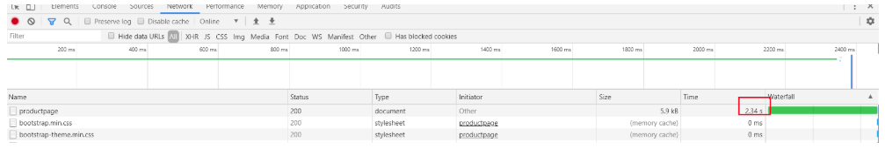

## 流量的迁移

>一个常见的用例是将流量从一个版本的微服务逐渐迁移到另一个版本。在 Istio 中，您可以通过配置一系列规则来实现此目标， 这些规则将一定百分比的流量路由到一个或另一个服务。在本任务中，您将会把 50％ 的流量发送到 `reviews:v1`，另外 50％ 的流量发送到 `reviews:v3`。然后，再把 100％ 的流量发送到 `reviews:v3` 来完成迁移。
>
>(1)让所有的流量都到v1
>
>~~~
>kubectl apply -f virtual-service-all-v1.yaml
>~~~
>
>(2)将v1的50%流量转移到v3
>
>~~~
>kubectl apply -f virtual-service-reviews-50-v3.yaml
>~~~
>
>(3)确保v3版本没问题之后，可以将流量都转移到v3
>
>~~~
>kubectl apply -f virtual-service-reviews-v3.yaml
>~~~
>
>(4)访问测试，看是否都访问的v3版本

## 体验Istio的Observe(观察)

> 观察mixer组件上报的服务数组

>采集指标：自动为Istio生成和收集的应用信息，可以配置的YAML文件
>
>> 进入bookinfo/telemetry目录下面
>
>* 如果需要metrics收集日志，需要先执行
>
>~~~sh
>kubectl apply -f metrics-crd.yaml
>~~~
>
>* 检查一下
>
>~~~sh
>kubectl get instance -n istio-system
>~~~
>
>>多次属性页面让metrics收集数据：http://192.168.187.137:31380/productpage
>>
>>现在需要访问普罗米修斯看看有没有拿到metrics收集到的数据，我们可以通过ingress来访问
>
>* 检查普罗米修斯ingress存不存在
>
>~~~sh
>kubectl get ingress -n istio-system
>~~~
>
>* 不存在则启动ingress
>
>~~~yaml
>kubectl apply -f prometheus-ingress.yaml
>~~~
>
>* 访问普罗米修斯域名
>
>~~~
>prometheus.istio.qy.com
>~~~
>
>* 检查一下有没有数据筛选选择： istio_requests_total 
>
>* 收集原理：
>
>  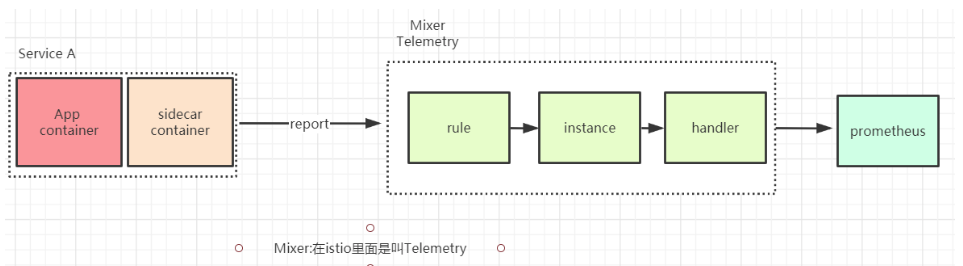
>
>* 启动grafana来可视化查看，检查grafana的ingress存不存在
>
>~~~
>kubectl get ingress -n istio-system
>~~~
>
>* 启动
>
>~~~
>kubectl apply -f grafana-ingress.yaml
>~~~
>
>* 访问grafana域名
>
>~~~
>grafana.istio.qy.com
>~~~
>
>* 配置grafana对应的普罗米修斯ip
>
>> * 查找普罗米修斯ip
>>
>> ~~~
>> kubectl get svc -o wide -n istio-system
>> ~~~
>
>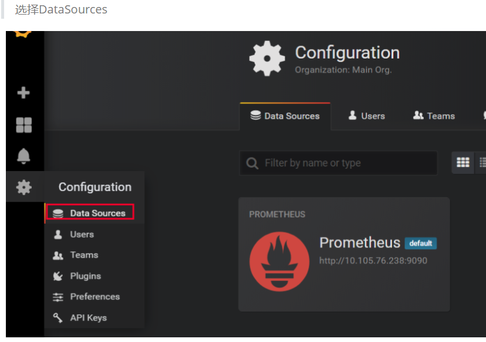
>
>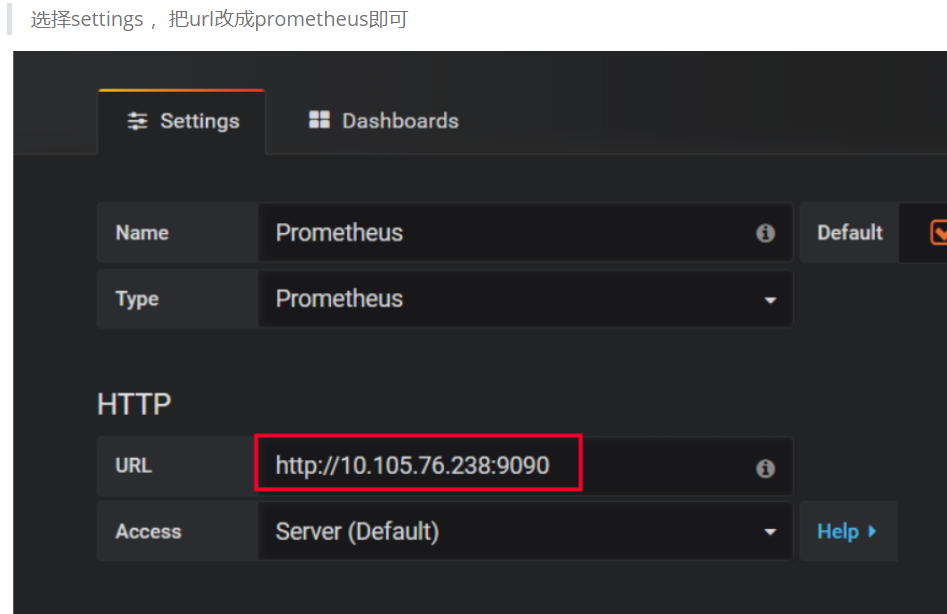
>
>* 访问istio mixer
>
>
>
>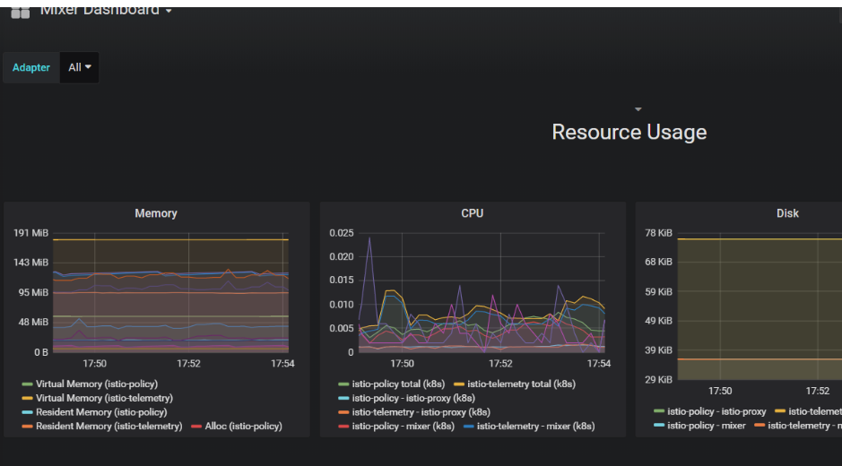
>
>> 这边就可以看到内存和CPU使用情况了