# 01 架构的发展历史

**发展历史时间轴**


## 1.1 单机小型机时代

```
第一个计算机网络诞生于1969年，也就是美军的阿帕网，阿帕网能够实现与其它计算机进行联机操作，但是早期仅仅是为了军事目的而服务
2000年初，中国的网民大约890万，很多人都不知道互联网为何物，因此大多数服务业务单一且简单，采用典型的单机+数据库模式，所有的功能都写在一个应用里并进行集中部署
```

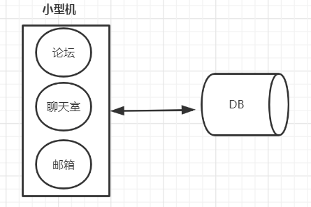

> 论坛业务、聊天室业务、邮箱业务全部都耦合在一台小型机上面，所有的业务数据也都存储在一台数据库上。
>

## 1.2 垂直拆分

~~~
随着应用的日益复杂与多样化，开发者对系统的容灾，伸缩以及业务响应能力有了更高的要求，如果小型机和数据库中任何一个出现故障，整个系统都会崩溃，若某个板块的功能需要更新，那么整个系统都需要重新发布，显然，对于业务迅速发展的万物互联网时代是不允许的。
如何保障可用性的同时快速响应业务的变化，需要将系统进行拆分，将上面的应用拆分出多个子应用。
~~~

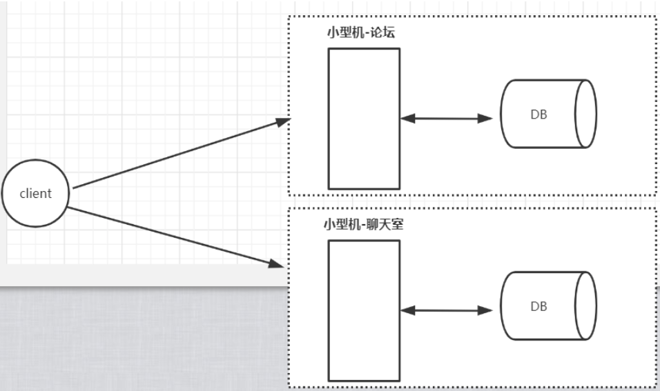

> 优点：应用跟应用解耦，系统容错提高了，也解决了独立应用发布的问题
>
> 应用垂直拆分解决了应用发布的问题，但是随着用户数量的增加，单机的计算能力依旧是杯水车薪

## 1.3 集群化负载均衡架构

~~~
用户量越来越大，就意味着需要更多的小型机，但是小型机价格昂贵，操作维护成本高。
此时更优的选择是采用多台PC机部署同一个应用的方案，但是此时就需要对这些应用做负载均衡，因为客户端不知道请求会落到哪一个后端PC应用上的。
~~~

~~~
负载均衡可以分为硬件层面和软件层面。
硬件层面：F5
软件负载层面：LVS、Nginx、Haproxy
负载均衡的思想：对外暴露一个统一的接口，根据用户的请求进行对应规则转发，同时负载均衡还可以做限流等等
~~~

~~~
有了负载均衡之后，后端的应用可以根据流量的大小进行动态扩容，我们称为"水平扩展"
~~~

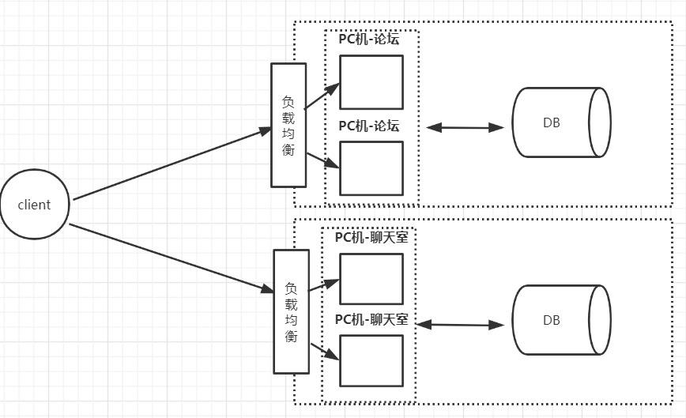

> 阿里巴巴在2008提出去“IOE”，也就是IBM小型机、Oracle数据库，EMC存储，全部改成集群化负载均衡架构，在2013年支付宝最后一台IBM小型机下线
>
> 优点：应用跟应用解耦，系统容错提高了，也解决了独立应用发布的问题，同时可以水平扩展来提供应用的并发量

## 1.4 服务化改造架构

```
虽然系统经过了垂直拆分，但是拆分之后发现在论坛和聊天室中有重复的功能，比如，用户注册、发邮件等等，一旦项目大了，集群部署多了，这些重复的功能无疑会造成资源浪费，所以会把重复功能抽取出来，名字叫"XX服务（Service）"
```

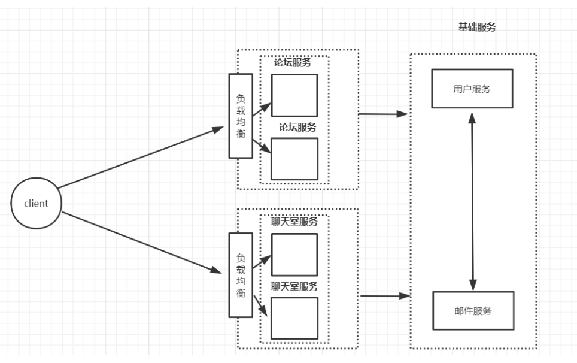

> 为了解决服务跟服务如何相互调用，需要一个程序之间的通信协议，所以就有了远程过程调用（RPC），作用就是让服务之间的程序调用变得像本地调用一样的简单
>
> 优点：在前面的架构之上解决了业务重用的问题

## 1.5 服务治理

```
随着业务的增大，基础服务越来越多，调用网的关系由最初的几个增加到几十上百，造成了调用链路错综复杂,需要对服务进行治理。

服务治理要求：
1、当我们服务节点数几十上百的时候，需要对服务有动态的感知，引入了注册中心
2、当服务链路调用很长的时候如何实现链路的监控
3、单个服务的异常，如何能避免整条链路的异常（雪崩），需要考虑熔断、降级、限流
4、服务高可用：负载均衡

典型框架比如有：Dubbo,默认采用的是Zookeeper作为注册中心。
```


## 1.6 微服务时代

> **分布式微服务时代**

```
微服务是在2012年提出的概念，微服务的希望的重点是一个服务只负责一个独立的功能。

拆分原则，任何一个需求不会因为发布或者维护而影响到不相关的服务，一切可以做到独立部署运维。

比如传统的“用户中心”服务，对于微服务来说，需要根据业务再次拆分，可能需要拆分成“买家服务”、“卖家服务”、“商家服务”等。

典型代表：Spring Cloud，相对于传统分布式架构，SpringCloud使用的是HTTP作为RPC远程调用，配合上注册中心Eureka和API网关Zuul，可以做到细分内部服务的同时又可以对外暴露统一的接口，让外部对系统内部架构无感，此外Spring Cloud的config组件还可以把配置统一管理。
```

> 马丁大师对微服务的定义：https://martinfowler.com/articles/microservices.html
>
> 微服务真正定义的时间是在2014年
>
> ~~~
> The term "Microservice Architecture" has sprung up over the last few years to describe a particular way of designing software applications as suites of independently deployable services. While there is no precise definition of this architectural style, there are certain common characteristics around organization around business capability, automated deployment, intelligence in the endpoints, and decentralized control of languages and data.
> ~~~
>
> > 大概意思：可独立部署服务，服务会越来越细
>
> spring cloud地址：https://spring.io/projects/spring-cloud

## 1.7 服务网格新时期 （service mesh）

### 1.7.1 背景

>  **早期**
>
>  ~~~
>  我们最开始用Spring+SpringMVC+Mybatis写业务代码
>  ~~~
>
>  **微服务时代**
>
>  > **微服务时代有了Spring Cloud就完美了吗？不妨想一想会有哪些问题?** 
>  >
>  > （1）最初是为了业务而写代码，比如登录功能、支付功能等，到后面会发现要解决网络通信的问题，虽然有 Spring Cloud里面的组件帮我们解决了，但是细想一下它是怎么解决的？在业务代码里面加上spring cloud maven依赖，加上spring cloud组件注解，写配置，打成jar的时候还必须要把非业务的代码也要融合在一起，称为“侵入式框架”； 
>  >
>  > （2）微服务中的服务支持不同语言开发，也需要维护不同语言和非业务代码的成本； 
>  >
>  > （3）业务代码开发者应该把更多的精力投入到业务熟悉度上，而不应该是非业务上，Spring Cloud虽然能解决微服务领域的很多问题，但是学习成本还是较大的；  
>  >
>  > （4）互联网公司产品的版本升级是非常频繁的，为了维护各个版本的兼容性、权限、流量等，因为Spring 
>  >
>  > Cloud是“代码侵入式的框架”，这时候版本的升级就注定要让非业务代码一起，一旦出现问题，再加上多语言之间的调用，工程师会非常痛苦； 
>  >
>  > （5）其实我们到目前为止应该感觉到了，服务拆分的越细，只是感觉上轻量级解耦了，但是维护成本却越高了，那么怎么 办呢？
>  >
>  > > 我们不是说spring cloud不好，只是为了引出service mesh, 目前spring cloud微服务还是比较主流的， 我们指出spring cloud的不好也只是为了突出service mesh的优点
>  >
>  > **问题解决思路**
>  >
>  > * 本质上是要解决服务之间通信的问题，不应该将非业务的代码融合到业务代码中 
>  >
>  > * 也就是从客户端发出的请求，要能够顺利到达对应的服务，这中间的网络通信的过程要和业务代码尽量无关
>  >
>  > ~~~
>  > 服务通信无非就是服务发现、负载均衡、版本控制等等
>  > ~~~
>  >
>  > * 在很早之前的单体架构中，其实通信问题也是需要写在业务代码中的，那时候怎么解决的呢？
>  >
>  > 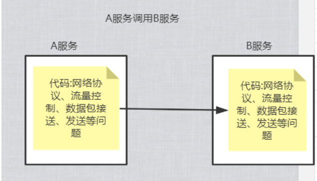
>  >
>  > ~~~
>  > 解决方案：把网络通信，流量转发等问题放到了计算机网络模型中的TCP/UDP层，也就是非业务功能代码下沉，把这些网络的问题下沉到计算机网络模型当中，也就是网络七层模型
>  > 网络七层模型：应用层、表示层、会话层、传输层、网络层、数据链路层、物理层
>  > ~~~
>  >
>  > 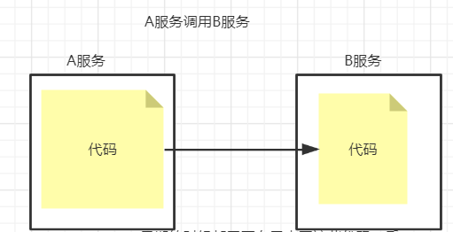
>  >
>  > **思考：**
>  >
>  > 我们是否也可以把每个服务配置一个代理，所有通信的问题都交给这个代理去做，就好比大家熟悉的nginx,haproxy其实它们做反向代理把请求转发给其他服务器,也就为 Service Mesh的诞生和功能实现提供了一个解决思路 
>

### 1.7.2 SideCar

~~~
它降低了与微服务架构相关的复杂性，并且提供了负载平衡、服务发现、流量管理、电路中断、遥测、故障注入等功能特性。
Sidecar模式是一种将应用功能从应用本身剥离出来作为单独进程的方式。该模式允许我们向应用无侵入添加多种功能，避免了为满足第三方组件需求而向应用添加额外的配置代码。
~~~

>很多公司借鉴了Proxy模式，推出了Sidecar的产品，比如像Netflix的Prana，蚂蚁金服的SofaMesh

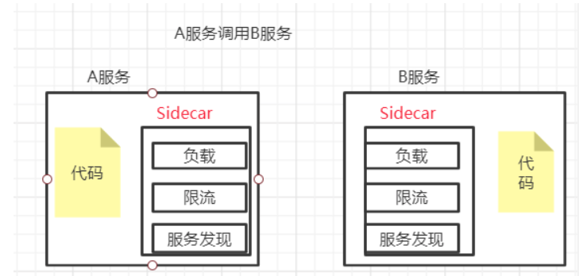

> ~~~
> 服务业务代码与Sidecar绑定在一起，每个服务都配置了一个Sidecar代理，每个服务所有的流量都经过sidecar,sidecar帮我们屏蔽了通信的细节，我的业务开发人员只需要关注业务就行了，而通信的事情交给sidecar处理
> ~~~
>
> 总结：可以理解成是代理，控制了服务的流量的进出，sidecar是为了通用基础设施而设计，可以做到与公司框架技术无侵入性
>
> > **SideCar的探索之路还在继续**
> >
> > ```
> > 很多公司借鉴了Proxy模式，推出了Sidecar的产品，比如像Netflix的Prana，蚂蚁金服的SofaMesh
> > 2014年 Netflix发布的Prana
> > 2015年 唯品会发布local proxy
> > 2016年 Twitter的基础设施工程师发布了第一款Service Mesh项目：Linkerd (所以下面介绍Linkerd)
> > ```
>
> 

### 1.7.3 Linkerd

~~~
2016年1月，离开Twitter的基础设施工程师打造的一个服务网格项目,第一个Service Mesh项目由此诞生，解决通用性。
Linkerd很好地结合了Kubernetes所提供的功能，以此为基础，在每个Kubernetes Node上都部署运行一个Linkerd实例，用代理的方式将加入Mesh的Pod通信转接给Linkerd，这样Linkerd就能在通信链路中完成对通信的控制和监控。
~~~

**Linkerd设计思想**

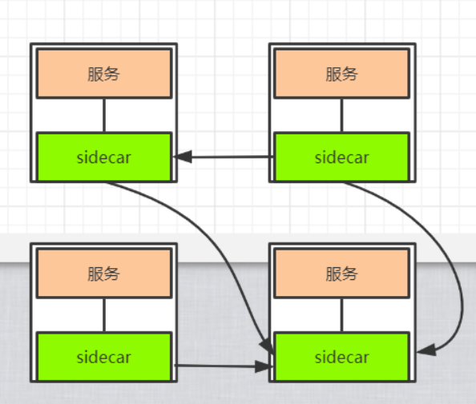

> Linderd的思想跟sidecar很类似，目标也是屏蔽网络通信细节

> Linkerd除了完成对Service Mesh的命名，以及Service Mesh各主要功能的落地，还有以下重要创举：
>
> * 无须侵入工作负载的代码，直接进行通信监视和管理；
> * 提供了统一的配置方式，用于管理服务之间的通信和边缘通信；
> *  除了支持Kubernetes，还支持多种底层平台。
>
> **总结：**
>
> * 跟我们前面sidecar很类似，以前的调用方式都是服务来调用服务，在Linkerd思想要求所有的流量都走sidecar，Linkerd帮业务人员屏蔽了通信细节，通信不需要侵入到业务代码内部了，这样业务开发者就专注于业务开发的本身
> * Linkerd在面世之后，迅速获得用户的关注，并在多个用户的生产环境上成功部署、运行。2017年，Linkerd加入CNCF，随后宣布完成对千亿次生产环境请求的处理，紧接着发布了1.0版本，并且具备一定数量的商业用户，一时间风光无限，一直持续到Istio横空出世。
>
> **问题:** 在早期的时候又要部署服务，又要部署sidecar，对于运维人员来说比较困难的，所以没有得到很好的发展，其实主要的 问题是Linkerd只是实现了数据层面的问题，但没有对其进行很好的管理。 
>
> > 数据层面:通过sidecar解决了数据处理的问题
>
> ~~~
> 打开github:搜索linkerd，是由scala语言编写的
> ~~~

### 1.7.4 istio

> 由Google、IBM和Lyft共同发起的开源项目
>
> ~~~
>打开github:搜索istio，是由go语言编写的
> ~~~
> 
> **什么是istio?**
>
> `地址`：https://istio.io/docs/concepts/what-is-istio/#why-use-istio
>
> ~~~
>Istio makes it easy to create a network of deployed services with load balancing, service-to-service authentication, monitoring, and more, with few or no code changes in service code. You add Istio support to services by deploying a special sidecar proxy throughout your environment that intercepts all network communication between microservices, then configure and manage Istio using its control plane functionality
> 翻译：
> 通过Istio，可以轻松创建带有负载平衡，服务到服务的身份验证，监视等功能的已部署服务网络，使得服务中的代码更改很少或没有更改。 通过在整个环境中部署一个特殊的sidecar代理来拦截微服务之间的所有网络通信，然后使用其控制平面功能配置和管理，可以为服务添加Istio支持。
> ~~~
> 
> 
>
> > **注意这句话：**
>>
> > ~~~
> > 使得服务中的代码更改很少或没有更改
> > ~~~
> >
> > 这句描述非常重要，如果我们用的是spring cloud通信功能，是不是要加依赖、加注解、改配置
> 
> **什么是控制平面？**
>
> ~~~
>控制平面就是来管理数据平面，也就是管理sideCar
> ~~~
> 
> 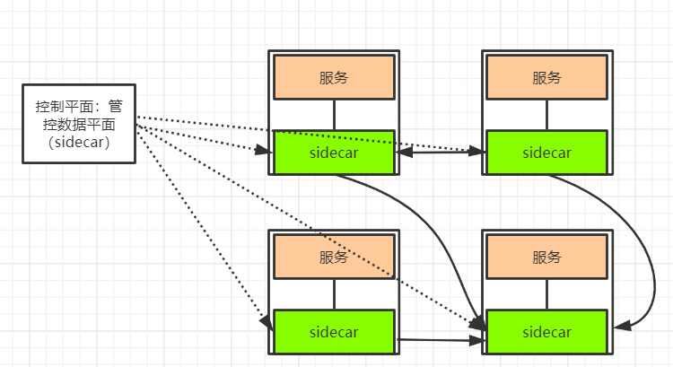
>
> **所以istio既有数据平面也有控制平面**
>
> **istio能干什么?**
>
> ~~~
>Automatic load balancing for HTTP, gRPC, WebSocket, and TCP traffic.
> Fine-grained control of traffic behavior with rich routing rules, retries, failovers, and fault injection.
> A pluggable policy layer and configuration API supporting access controls, rate limits and quotas.
> Automatic metrics, logs, and traces for all traffic within a cluster, including cluster ingress and egress.
> Secure service-to-service communication in a cluster with strong identity-based authentication and authorization.
> 翻译：
> 1.HTTP、gRPC、WebSocket和TCP流量的自动负载平衡。
> 2.路由、重试、故障转移和故障注入对流量行为进行细粒度控制。
> 3.支持访问控制、速率限制、配置API。
> 4.集群内所有流量的自动衡量、日志和跟踪，包括集群入口和出口。
> 5.使用基于身份验证和授权来保护集群中服务跟服务之间的通信。
> ~~~
> 
> **总结：**很明显Istio不仅拥有“数据平面（Data Plane）”，而且还拥有“控制平面（Control Plane），也就是拥有了数据 接管与集中控制能力。

### 1.7.5 什么是服务网格

> 服务网格：指的是微服务网络应用之间的交互，随着规模和复杂性增加，服务跟服务调用错综复杂

**如下图所示**

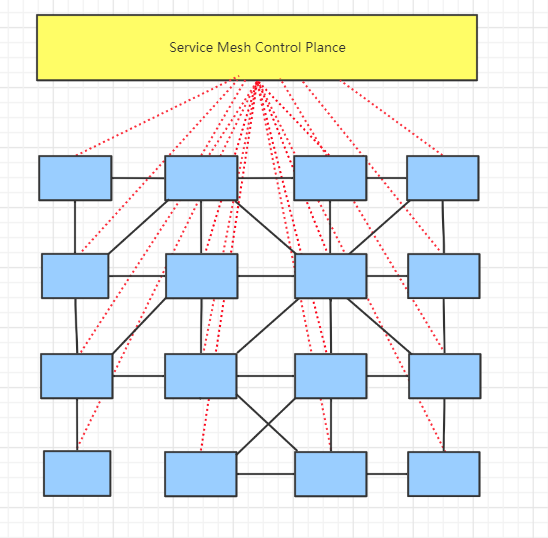

> 如果每一个格子都是一个sidecar数据平面，然后sidecar进行彼此通信，那么servicemech就是来管理每个格子的控制平面,这就是服务网格，从架构层面看起来跟网格很像

~~~
特点：
基础设施：服务网格是一种处理服务之间通信的基础设施层。
支撑云原生：服务网格尤其适用于在云原生场景下帮助应用程序在复杂的服务间可靠地传递请求。
网络代理：在实际使用中，服务网格一般是通过一组轻量级网络代理来执行治理逻辑的。
对应用透明：轻量网络代理与应用程序部署在一起，但应用感知不到代理的存在，还是使用原来的方式工作。

~~~


### 1.7.6 什么是Service Mesh

> **istio官网 也对什么是service mesh给出了定义**
>
> `地址`：https://istio.io/docs/concepts/what-is-istio/#what-is-a-service-mesh
>
> ~~~
> Istio addresses the challenges developers and operators face as monolithic applications transition towards a distributed microservice architecture. To see how, it helps to take a more detailed look at Istio’s service mesh.
> 翻译：
> 解决开发与运维部署分布式微服务面临的问题
> ~~~
>
> ~~~
>The term service mesh is used to describe the network of microservices that make up such applications and the interactions between them. As a service mesh grows in size and complexity, it can become harder to understand and manage. Its requirements can include discovery, load balancing, failure recovery, metrics, and monitoring. A service mesh also often has more complex operational requirements, like A/B testing, canary rollouts, rate limiting, access control, and end-to-end authentication.
> 翻译：
>也是解决微服务之间服务跟服务之间通信的问题，可以包括服务发现、负载平衡、故障恢复、度量和监视，服务网格通常还具有更复杂的操作需求，如A/B测试、速率限制、访问控制和端到端身份验证
> ~~~

### 1.7.7 CNCF云原生组织发展和介绍

**云原生发展历史时间轴**

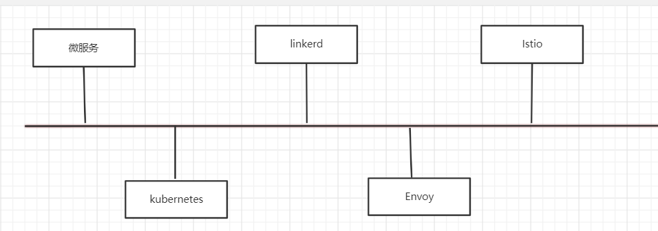

- 微服务

```
马丁大师在2014年定义了微服务 
```

- Kubernetes

```
从2014年6月由Google宣布开源，到2015年7月发布1.0这个正式版本并进入CNCF基金会，再到2018年3月从CNCF基金会正式毕业，迅速成为容器编排领域的标准，是开源历史上发展最快的项目之一
```

- Linkerd

```
Scala语言编写，运行在JVM中，Service Mesh名词的创造者 
2016年01月15号，0.0.7发布 
2017年01月23号，加入CNCF组织 
2017年04月25号，1.0版本发布
```

- Envoy

```
envoy是一个开源的服务代理，为云原生设计的程序，由C++语言编程[Lyft] 
2016年09月13号，1.0发布 
2017年09月14号，加入CNCF组织
```

- Istio

```
Google、IBM、Lyft发布0.1版本
Istio是开源的微服务管理、保护和监控框架。Istio为希腊语，意思是”起航“。
```


**CNCF介绍**

~~~
CNCF 是一个开源软件基金会，致力于使云原生计算具有普遍性和可持续性。 云原生计算使用开源软件技术栈将应用程序部署为微服务，将每个部分打包到自己的容器中，并动态编排这些容器以优化资源利用率。 云原生技术使软件开发人员能够更快地构建出色的产品。
~~~

>  **CNCF解决了什么问题**
>
>  * 统一基础平台：kubernetes
>
>  * 如果我们需要日志监控：Prometheus
>
>  * 需要代理：Envoy
>  * 需要分布式链路跟踪：Jaeger
>  * ......
>
>  
>
>  `地址`：https://www.cncf.io/
>
>  **介绍几个常用的已经毕业的云原生项目**
>
>  > * Kubernetes
>  >
>  > ~~~
>  > Kubernetes 是世界上最受欢迎的容器编排平台也是第一个 CNCF 项目。 Kubernetes 帮助用户构建、扩展和管理应用程序及其动态生命周期。
>  > ~~~
>  >
>  > * Prometheus
>  >
>  > ~~~
>  > Prometheus 为云原生应用程序提供实时监控、警报包括强大的查询和可视化能力，并与许多流行的开源数据导入、导出工具集成。
>  > ~~~
>  >
>  > * Jaeger
>  >
>  > ~~~
>  > Jaeger 是由 Uber 开发的分布式追踪系统，用于监控其大型微服务环境。 Jaeger 被设计为具有高度可扩展性和可用性，它具有现代 UI，旨在与云原生系统（如 OpenTracing、Kubernetes 和 Prometheus）集成。
>  > ~~~
>  >
>  > * Containerd
>  >
>  > ~~~
>  > Containerd 是由 Docker 开发并基于 Docker Engine 运行时的行业标准容器运行时组件。 作为容器生态系统的选择，Containerd 通过提供运行时，可以将 Docker 和 OCI 容器镜像作为新平台或产品的一部分进行管理。
>  > ~~~
>  >
>  > * Envoy
>  >
>  > ~~~
>  > Envoy 是最初在 Lyft 创建的 Service Mesh（服务网格），现在用于Google、Apple、Netflix等公司内部。 Envoy 是用 C++ 编写的，旨在最大限度地减少内存和 CPU 占用空间，同时提供诸如负载均衡、网络深度可观察性、微服务环境中的跟踪和数据库活动等功能。
>  > ~~~
>  >
>  > * Fluentd
>  >
>  > ~~~
>  > Fluentd 是一个统一的日志记录工具，可收集来自任何数据源（包括数据库、应用程序服务器、最终用户设备）的数据，并与众多警报、分析和存储工具配合使用。 Fluentd 通过提供一个统一的层来帮助用户更好地了解他们的环境中发生的事情，以便收集、过滤日志数据并将其路由到许多流行的源和目的地。  
>  > ~~~
>
>  **孵化中的项目**，
>
>  > * Open Tracing
>  >
>  > ~~~
>  > OpenTracing：为不同的平台，供应中立的API，使开发人员可以轻松地应用分布式跟踪。
>  > ~~~
>  >
>  > * GRPC
>  >
>  > ~~~
>  > gRPC 是一个高性能、开源和通用的 RPC 框架,语言中立，支持多种语言。
>  > ~~~
>  >
>  > * CNI
>  >
>  > ~~~
>  > CNI 就是这样一个标准，它旨在为容器平台提供网络的标准化。不同的容器平台能够通过相同的接口调用不同的网络组件。
>  > ~~~
>  >
>  > * Helm
>  >
>  > ~~~
>  > Helm 是 Kubernetes 的包管理器。包管理器类似于我们在Centos中使用的yum一样，能快速查找、下载和安装软件包。
>  > ~~~
>  >
>  > * Etcd
>  >
>  > ~~~
>  > 一个高可用的分布式键值(key-value)数据库。etcd内部采用raft协议作为一致性算法，etcd基于Go语言实现。一般用的最多的就是作为一个注册中心来使用
>  > ~~~
>
>  


### 1.7.8 国内兴起的服务网格

~~~
前面提到，在Service Mesh这个概念得到具体定义之前，实际上已经有很多厂商开始了微服务新的尝试，这一动作势必引发对微服务治理的强劲需求。在Service Mesh概念普及之后，有的厂商意识到自身产品也具备Service Mesh的特点，也有厂商受其启发，将自有的服务治理平台进行完善和改造，推出自己的Service Mesh产品。例如，蚂蚁金服、腾讯和华为都推出自己的网格产品，华为的产品甚至已被投入公有云进行商业应用。
~~~

> * 蚂蚁金服 sofa Mesh
>
> **代理架构**
>
> 
>
> >  前身是SOFA RPC ，2018年07月正式开源 
>
> * 腾讯 Tencent Service Mesh
>
> **代理架构**
>
> 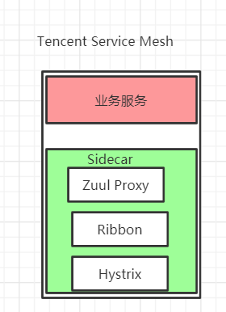
>
> * 华为  CSE Mesher
>
> **代理架构**
>
> 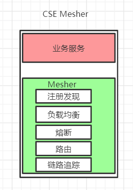
>
> `总结:` 基本上都借鉴了Sidecar、Envoy和Istio等设计思想


# 02 Istio 基本介绍

## 2.1 什么是Istio 

> `地址`：https://istio.io/

~~~
服务网格是一个独立的基础设施层，用来处理服务之间的通信。现代的云原生应用是由各种复杂技术构建的服务体系，服务网格负责在这些组成部分之间进行可靠的请求传递。目前典型的服务网格通常提供了一组轻量级的网络代理，这些代理会在应用无感知的情况下，同应用并行部署、运行。
~~~

~~~
前面提到，Istio出自名门，由Google、IBM和Lyft在2017年5月合作推出，它的初始设计目标是在Kubernetes的基础上，以非侵入的方式为运行在集群中的微服务提供流量管理、安全加固、服务监控和策略管理等功能。

Istio有助于降低部署的复杂性，并减轻开发团队的压力。它是一个完全开放源代码的服务网格，透明地分层到现有的分布式应用程序上。它也是一个平台，包括允许它集成到任何日志平台、遥测或策略系统中的api。Istio的多种功能集使我们能够成功、高效地运行分布式微服务体系结构，并提供一种统一的方式来保护、连接和监视微服务。
~~~

**传统的spring cloud微服务项目**

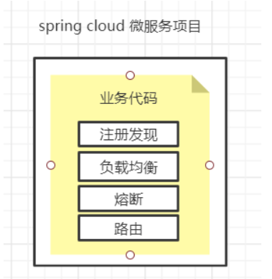

**基于Istio架构微服务项目 **

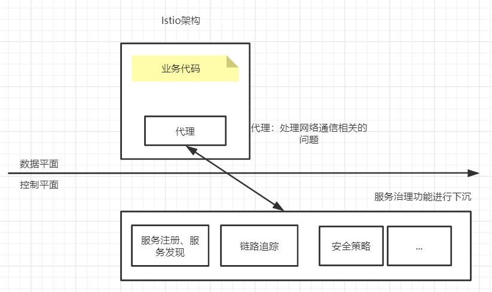

> Istio是基于Sidecar模式、数据平面和控制平台、是主流Service Mesh解决方案。

## 2.2 Istio特征

> `地址`：https://istio.io/zh/

* **连接**：对网格内部的服务之间的调用所产生的流量进行智能管理，并以此为基础，为微服务的部署、测试和升级等操作提供有力保障。
*  **安全**：为网格内部的服务之间的调用提供认证、加密和鉴权支持，在不侵入代码的情况下，加固现有服务，提高其安全性。
* **策略**：在控制平面定制策略，并在服务中实施。

* **观察**：对服务之间的调用进行跟踪和测量，获取服务的状态信息。

**下面对这些特性展开详细描述。**

### **2.2.1 连接**

~~~
微服务错综复杂，要完成其业务目标，连接问题是首要问题。连接存在于所有服务的整个生命周期中，用于维持服务的运行，算得上重中之重。
相对于传统的单体应用，微服务的端点数量会急剧增加，现代的应用系统在部分或者全部生命周期中，都存在同一服务的不同版本，为不同的客户、场景或者业务提供不同的服务。同时，同一服务的不同版本也可能有不同的访问要求，甚至产生了在生产环境中进行测试的新方法论。错综复杂的服务关系对开发者来说都是很严峻的考验。
~~~

> 针对目前的常见业务形态，这里画一个简单的示意图来描述Service Mesh的连接功能
>
> 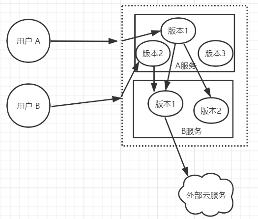
>
> ~~~
> 从不同的外部用户的角度来看，他们访问的都是同一服务端口，但实际上会因为不同的用户识别，分别访问服务A的不同版本；在网格内部，服务A的版本1可能会访问服务B的两个版本，服务A的版本2则只会访问服务B的版本1；服务B的版本1需要访问外部的云服务，版本2则无此需求。
> 在这个简化的模型中，包含了以下诉求：
> ◎ 网格内部的调用（服务A→服务B）；
> ◎ 出站连接（服务B→外部云服务）；
> ◎ 入站连接（用户→服务A）；
> ◎ 流量分割（A服务跟B服务只负责与自己相关流量请求）；
> ◎ 按调用方的服务版本进行路由（服务A的版本1分别调用了服务B的版本1和版本2）；
> ◎ 按用户身份进行路由。
> 
> 这里除了这些问题，还存在一些潜在需求，如下所述。
> （1）在网格内部的服务之间如何根据实际需要对服务间调用进行路由，条件可能包括：
>     ◎ 调用的源和目的服务；
>     ◎ 调用内容；
>     ◎ 认证身份。
> （2）如何应对网络故障或者服务故障。
> （3）如何处理不同服务不同版本之间的关系。
> （4）怎样对出站连接进行控制。
> （5）怎样接收入站连接来启动后续的整个服务链条。
> 
> 这些当然不是问题的全部，其中，与流量相关的问题还引发了几个关键的功能需求，如下所述。
> （1）服务注册和发现：要求能够对网格中不同的服务和不同的版本进行准确标识，不同的服务可以经由同一注册机构使用公认的方式互相查找。
> （2）负载均衡策略：不同类型的服务应该由不同的策略来满足不同的需要。
> （3）服务流量特征：在服务注册发现的基础之上，根据调用双方的服务身份，以及服务流量特征来对调用过程进行甄别。
> （4）动态流量分配：根据对流量特征的识别，在不同的服务和版本之间对流量进行引导。
> 
> 连接是服务网格应用过程中从无到有的最重要的一个环节。
> ~~~

### 2.2.2 安全

~~~
安全也是一个常谈常新的话题，在过去私有基础设施结合单体应用的环境下，这一问题并不突出，然而进入容器云时代之后，以下问题出现了。
（1）有大量容器漂浮在容器云中，采用传统的网络策略应对这种浮动的应用是比较吃力的。
（2）在由不同的语言、平台所实现的微服务之间，实施一致的访问控制也经常会因为实现的不一致而困难重重。
（3）如果是共享集群，则服务的认证和加密变得尤为重要，例如：
    ◎ 服务之间的通信要防止被其他服务监听；
    ◎ 只有提供有效身份的客户端才可以访问指定的服务；
    ◎ 服务之间的相互访问应该提供更细粒度的控制功能。

总之，要提供网格内部的安全保障，就应具备服务通信加密、服务身份认证和服务访问控制（授权和鉴权）功能。
上述功能通常需要数字证书的支持，这就隐藏了对CA的需求，即需要完成证书的签发、传播和更新业务。
除了上述核心要求，还存在对认证失败的处理、外部证书（统一 CA）的接入等相关支撑内容。
~~~

### 2.2.3 策略

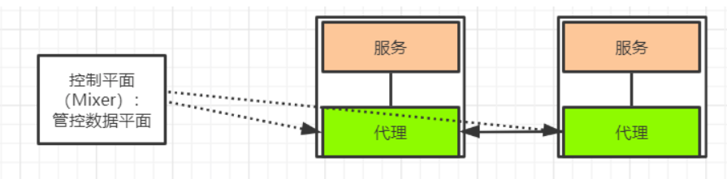

~~~


Istio 通过可动态插拔、可扩展的策略实现访问控制、速率限制、配额管理等功能使得资源在消费者之间公平分配

在Istio中使用Mixer作为策略的执行者，Envoy的每次调用，在逻辑上都会通过Mixer进行事先预检和事后报告，这样Mixer就拥有了对流量的部分控制能力；在Istio中还有为数众多的内部适配器及进程外适配器，可以和外部软件设施一起完成策略的制定和执行。
~~~

> **组件简单介绍，后面会详细讲解**
>
> Mixer: Mixer 在整个服务网格中执行访问控制和策略执行，并从 Envoy 代理和其他服务收集遥测数据。
>
> Envoy: 在istio框架中使用Envoy作为代理，使用的是C++开发的软件，用于为服务网格中的所有服务提供所有的入站和出站流量,唯一一个与数据平面打交道的

### 2.2.4 观察

~~~
随着服务数量的增加，监控和跟踪需求自然水涨船高。在很多情况下，可观察的保障都是系统功能的重要组成部分，是系统运维功能的重要保障。
随着廉价服务器（相对于传统小型机）的数量越来越多，服务器发生故障的频率也越来越高，人们开始产生争论：我们应该将服务器视为家畜还是宠物？家畜的特点：是有功能、无个性、可替换；而宠物的特点：是有功能、有个性、难替换。
我们越来越倾向于将服务器视为无个性、可替换的基础设施，如果主机发生故障，那么直接将其替换即可；并且，我们更加关注的是服务的总体质量。因此，微服务系统监控，除了有传统的主机监控，还更加重视高层次的服务健康监控。
服务的健康情况往往不是非黑即白的离散值，而是一系列连续状态，例如我们经常需要关注服务的调用成功率、响应时间、调用量、传输量等表现。
而且，面对数量众多的服务，我们应该能对各种级别和层次的指标进行采样、采集及汇总，获取较为精密、翔实的运行数据，最终通过一定的方法进行归纳总结和展示。
与此同时，服务网格还应提供分布式跟踪功能，对服务的调用链路进行跟踪。

观察性：动态获取服务运行数据和输出，提供强大的调用链、监控和调用日志收集输出的能力。配合可视化工具，可方便运维人员了解服务的运行状况，发现并解决问题。
~~~

## 2.3 Istio与服务治理

~~~
Istio是一个服务治理平台，治理的是服务间的访问，只要有访问就可以治理，不在乎这个服务是不是是所谓的微服务，也不要求跑的代码是微服务化的。单体应用不满足微服务用Istio治理也是完全可以的。提起“服务治理”，大家最先想到的一定是“微服务的服务治理”，就让我们从微服务的服务治理说起。
~~~

### 2.3.1服务治理的三种形态

服务治理的演变至少经过了以下三种形态。

**第1种形态：在应用程序中包含治理逻辑**

~~~
在微服务化的过程中，将服务拆分后会发现一堆麻烦事儿，连基本的业务连通都成了问题。在处理一些治理逻辑，比如怎么找到对端的服务实例，怎么选择一个对端实例发出请求，都需要自己写代码来实现。这种方式简单，对外部依赖少，但会导致存在大量的重复代码。所以，微服务越多，重复的代码越多，维护越难；而且，业务代码和治理逻辑耦合，不管是对治理逻辑的全局升级，还是对业务的升级，都要改同一段代码。
~~~

**如下图所示**

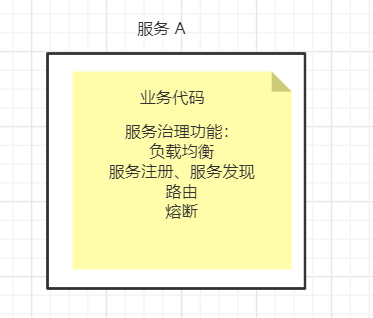

**第2种形态：治理逻辑独立的代码**

~~~
在解决第1种形态的问题时，我们很容易想到把治理的公共逻辑抽象成一个公共库，让所有微服务都使用这个公共库。在将这些治理能力包含在开发框架中后，只要是用这种开发框架开发的代码，就包含这种能力，非常典型的这种服务治理框架就是Spring Cloud。这种形态的治理工具在过去一段时间里得到了非常广泛的应用。
SDK模式虽然在代码上解耦了业务和治理逻辑，但业务代码和 SDK还是要一起编译的，业务代码和治理逻辑还在一个进程内。这就导致几个问题：业务代码必须和 SDK 基于同一种语言，即语言绑定。例如，Spring Cloud等大部分治理框架都基于Java，因此也只适用于 Java 语言开发的服务。经常有客户抱怨自己基于其他语言编写的服务没有对应的治理框架；在治理逻辑升级时，还需要用户的整个服务升级，即使业务逻辑没有改变，这对用户来说是非常不方便的。
~~~

**如下图所示**

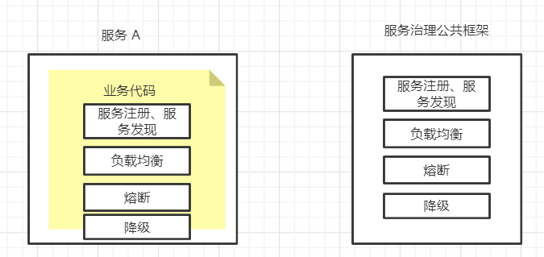

**第3种形态：治理逻辑独立的进程**

~~~
SDK模式仍旧侵入了用户的代码，那就再解耦一层，把治理逻辑彻底从用户的业务代码中剥离出来，这就是前面提过的Sidecar模式。显然，在这种形态下，用户的业务代码和治理逻辑都以独立的进程存在，两者的代码和运行都无耦合，这样可以做到与开发语言无关，升级也相互独立。在对已存在的系统进行微服务治理时，只需搭配 Sidecar 即可，对原服务无须做任何修改，并且可以对老系统渐进式升级改造，先对部分服务进行微服务化。
~~~

**如下图所示**

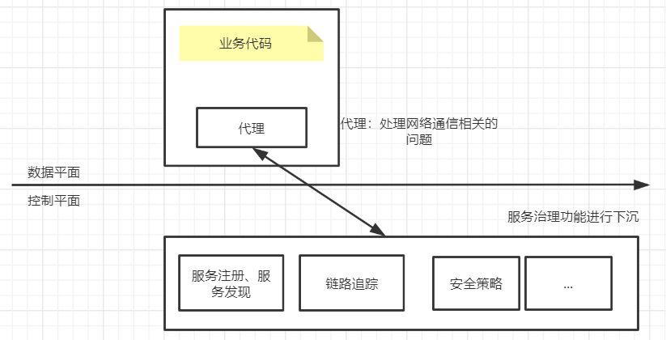

**总结**

~~~
比较以上三种服务治理形态，我们可以看到服务治理组件的位置在持续下沉，对应用的侵入逐渐减少。

微服务作为一种架构风格，更是一种敏捷的软件工程实践，说到底是一套方法论；与之对应的 Istio 等服务网格则是一种完整的实践，Istio 更是一款设计良好的具有较好集成及可扩展能力的可落地的服务治理工具和平台。
所以，微服务是一套理论，Istio是一种实践。
~~~

## 2.4 Istio与Kubernetes

### 2.4.1 Kubernetes介绍

~~~
Kubernetes是一款用于管理容器化工作的负载和服务的可移植、可扩展的开源平台，拥有庞大、快速发展的生态系统，它面向基础设施，将计算、网络、存储等资源进行紧密整合，为容器提供最佳运行环境，并面向应用提供封装好的、易用的工作负载与服务编排接口，以及运维所需的资源规格、弹性、运行参数、调度等配置管理接口，是新一代的云原生基础设施平台。
从平台架构而言，Kubernetes的设计围绕平台化理念，强调插件化设计与易扩展性，这是它与其他同类系统的最大区别之一，保障了对各种不同客户应用场景的普遍适应性。另外，Kubernetes与其他容器编排系统的显著区别是Kubernetes并不把无状态化、微服务化等条件作为可运行的工作负载的约束。
如今，容器技术已经进入产业落地期，而Kubernetes作为容器平台的标准已经得到了广泛应用。
~~~

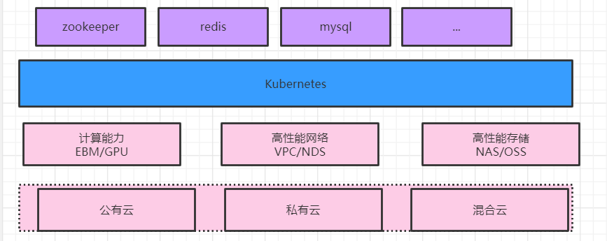

### 2.4.2 Istio是Kubernetes的好帮手

~~~
从场景来看，Kubernetes已经提供了非常强大的应用负载的部署、升级、扩容等运行管理能力。Kubernetes 中的 Service 机制也已经可以做服务注册、服务发现和负载均衡，支持通过服务名访问到服务实例。
从微服务的工具集观点来看，Kubernetes本身是支持微服务的架构，在Pod中部署微服务很合适，也已经解决了微服务的互访互通问题，但对服务间访问的管理如服务的熔断、限流、动态路由、调用链追踪等都不在Kubernetes的能力范围内。那么，如何提供一套从底层的负载部署运行到上层的服务访问治理端到端的解决方案？
目前，最完美的答案就是在Kubernetes上叠加Istio这个好帮手
~~~

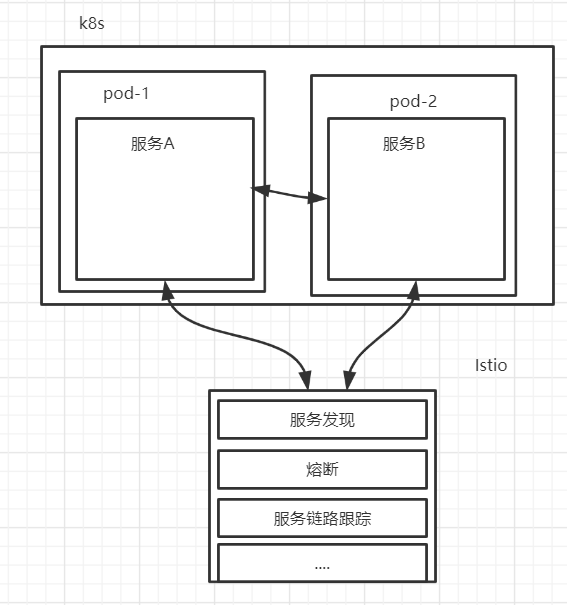

### 2.4.3 Kubernetes是Istio的好基座

>Istio最大化地利用了Kubernetes这个基础设施，与之叠加在一起形成了一个更强大的用于进行服务运行和治理的基础设施，充分利用了Kubernetes的优点实现Istio的功能，例如：
>
>1.数据面
>
>~~~
>数据面Sidecar运行在Kubernetes的Pod里，作为一个Proxy和业务容器部署在一起。在服务网格的定义中要求应用程序在运行的时感知不到Sidecar的存在。而基于Kubernetes的一个 Pod 多个容器的优秀设计使得部署运维
>对用户透明，用户甚至感知不到部署 Sidecar的过程。用户还是用原有的方式创建负载，通过 Istio 的自动注入服务，可以自动给指定的负载注入Proxy。如果在另一种环境下部署和使用Proxy，则不会有这样的便利。
>~~~
>
>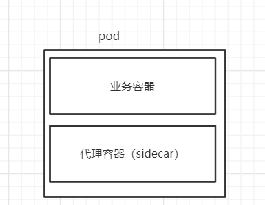
>
>2.统一服务发现
>Istio的服务发现机制非常完美地基于Kubernetes的域名访问机制构建而成，省去了再搭一个类似 Eureka 的注册中心的麻烦，更避免了在 Kubernetes 上运行时服务发现数据不一致的问题。
>
>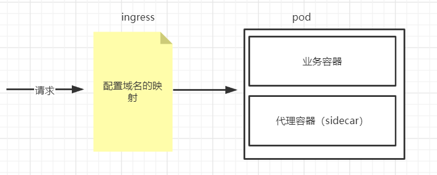
>
>
>
>3.基于Kubernetes CRD描述规则
>Istio的所有路由规则和控制策略都是通过 Kubernetes CRD实现的，因此各种规则策略对应的数据也被存储在 Kube-apiserver 中，不需要另外一个单独的 APIServer 和后端的配置管理。所以，可以说Istio的APIServer就是Kubernetes的APIServer，数据也自然地被存在了对应Kubernetes的etcd中。
>
>Istio非常巧妙地应用了Kubernetes这个好基座，基于Kubernetes的已有能力来构建自身功能。Kubernetes里已经有的，绝不再自己搞一套，避免了数据不一致和用户使用体验的问题。
>
>Istio和Kubernetes架构的关系，可以看出，Istio不仅数据面Envoy跑在Kubernetes的Pod里，其控制面也运行在Kubernetes集群中，其控制面组件本身存在的形式也是以Kubernetes Deployment和Service，基于Kubernetes扩展和构建。
>
>

> **回顾一下上面提到的K8S组件**
>
> * APIServer
>
> ~~~
> API Server提供了k8s各类资源对象（pod,RC,Service等）的增删改查及watch等HTTP Rest接口，是整个系统的数据总线和数据中心。
> 
> kubernetes API Server的功能：
> -提供了集群管理的REST API接口(包括认证授权、数据校验以及集群状态变更)；
> -提供其他模块之间的数据交互和通信的枢纽（其他模块通过API Server查询或修改数据，只有API Server才直接操作etcd）;
> -是资源配额控制的入口；
> -拥有完备的集群安全机制.
> ~~~
>
> * Deployment
>
> ~~~
> 一旦运行了 Kubernetes 集群，就可以在其上部署容器化应用程序。 为此，需要创建 Kubernetes Deployment 配置。
> Deployment 负责 Kubernetes 如何创建和更新应用程序的实例。
> ~~~
>
> * Service
>
> ~~~
> Service可以看作是一组提供相同服务的Pod对外的访问接口。借助Service，应用可以方便地实现服务发现和负载均衡
> ~~~
>
> * Ingress
>
> ~~~
> ingress是Kubernetes资源的一种，可以让外部请求访问到k8s内部的资源上
> ~~~
>
> 

**总结**

~~~
Kubernetes在容器编排领域已经成为无可争辩的事实标准；微服务化的服务与容器在轻量、敏捷、快速部署运维等特征上匹配，这类服务在容器中的运行也正日益流行；随着Istio 的成熟和服务网格技术的流行，使用 Istio 进行服务治理的实践也越来越多，正成为服务治理的趋势；而 Istio 与 Kubernetes 的天然融合且基于 Kubernetes 构建，也补齐了Kubernetes的治理能力，提供了端到端的服务运行治理平台。这都使得Istio、微服务、容器及Kubernetes形成一个完美的闭环。

云原生应用采用 Kubernetes 构建应用编排能力，采用 Istio 构建服务治理能力，将逐渐成为企业技术转型的标准配置。
~~~

## 2.5 Istio与服务网格

### 2.5.1 时代选择服务网格

>在云原生时代，随着采用各种语言开发的服务剧增，应用间的访问拓扑更加复杂，治理需求也越来越多。原来的那种嵌入在应用中的治理功能无论是从形态、动态性还是可扩展性来说都不能满足需求，迫切需要一种具备云原生动态、弹性特点的应用治理基础设施。
>
>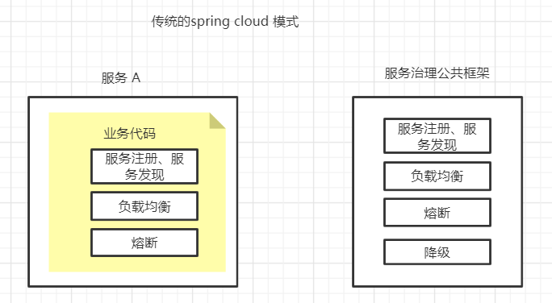
>
>采用Sidecar代理与应用进程的解耦带来的是应用完全无侵入、也屏蔽了开发语言无关等特点解除了开发语言的约束，从而极大降低了应用开发者的开发成本。
>
>这种方式也经常被称为一种应用的基础设施层，类比TCP/IP网络协议栈，应用程序像使用TCP/IP一样使用这个通用代理：TCP/IP 负责将字节码可靠地在网络节点之间传递，Sidecar 则负责将请求可靠地在服务间进行传递。TCP/IP 面向的是底层的数据流，Sidecar 则可以支持多种高级协议（HTTP、gRPC、HTTPS 等），以及对服务运行时进行高级控制，使服务变得可监控、可管理。
>
>然后，从全局来看，在多个服务间有复杂的互相访问时才有服务治理的需求。即我们关注的是这些 Sidecar 组成的网格，对网格内的服务间访问进行管理，应用还是按照本来的方式进行互相访问，每个应用程序的入口流量和出口流量都要经过Sidecar代理，并在Sidecar上执行治理动作。
>
>最后，Sidecar是网格动作的执行体，全局的管理规则和网格内的元数据维护需要通过一个统一的控制面实现。
>Sidecar拦截入口流量，执行治理动作。这就引入两个问题：
>◎ 增加了两处延迟和可能的故障点；
>◎ 多出来的这两跳对于访问性能、整体可靠性及整个系统的复杂度都带来了新的挑战。
>
>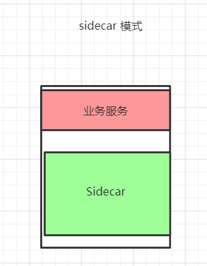
>
>所以，对于考虑使用服务网格的用户来说，事情就会变成一个更简单的选择题：是否愿意花费额外的资源在这些基础设施上来换取开发、运维的灵活性、业务的非侵入性和扩展性等便利。
>
>目前，华为、谷歌、亚马逊等云服务厂商将这种服务以云服务形态提供了出来，并和底层的基础设施相结合，提供了完整的服务治理解决方案。这对于广大应用开发者来说，更加方便和友好。
>


### 2.5.2 服务网格选择Istio

>
>
>在多种服务网格项目和产品中，最引人注目的是后来居上的 Istio，它有希望成为继Kubernetes之后的又一款
>
>重量级产品。
>
>Istio 解决了生产大规模集群的性能、资源利用率和可靠性问题，提供了众多生产中实际应用的新特性，已经达到企业级可用的标准。
>
>首先，在控制面上，Istio作为一种全新的设计，在功能、形态、架构和扩展性上提供了远超服务网格的能力范围。它提供了一套标准的控制面规范，向数据面传递服务信息和治理规则。
>
>Istio使用Envoy V2版本的API，即gRPC协议。标准的控制面API解耦了控制面和数据面的绑定。
>
>最后，在大厂的支持上，Istio 由谷歌和 IBM 共同推出，从应用场景的分析规划到本身的定位，从自身架构的设计到与周边生态的结合，都有着比较严密的论证。Istio项目在发起时已经确认了将云原生生态系统中的容器作为核心，将Kubernetes作为管理容器的编排系统，需要一个系统管理在容器平台上运行的服务之间的交互，包括控制访问、安全、运行数据收集等，而 Istio 正是为此而生的；另外，Istio 成为架构的默认部分，就像容器和Kubernetes已经成为云原生架构的默认部分一样。
>
>云原生社区的定位与多个云厂商的规划也不谋而合。华为云已经在 2018 年 8 月率先在其容器服务CCE（Cloud Container Engine）中内置Istio；Google的GKE也在2018年12月宣布内置 Istio；越来越多的云厂商也已经选择将 Istio作为其容器平台的一部分提供给用户，即提供一套开箱即用的容器应用运行治理的全栈服务。正因为看到了 Istio 在技术和产品上的巨大潜力，各大厂商在社区的投入也在不断加大，其中包括Google、IBM、华为、思科、红帽等主流厂商。

**istio原理图**

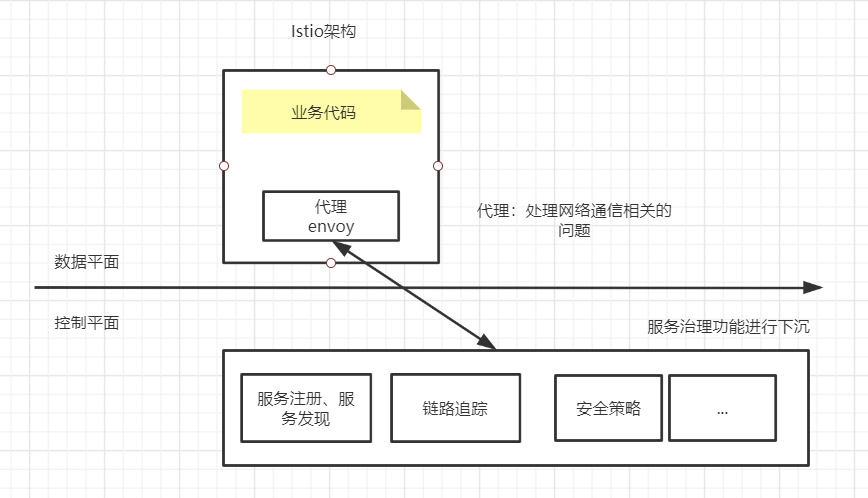

**总结**

~~~
时代选择服务网格是因为架构的发展
服务网格选择istio是因为提供一套开箱即用的容器应用运行治理的全栈服务
~~~


# 总结

> 本节课主要是围绕Service Mesh来介绍，包括了架构发展历史（包括每一种架构的优缺点）、服务网格发展历史、云原生的介绍、Sidecar代理模式、istio与服务治理/kubernetes/服务网格之间的关系，为后续深入学习Istio框架做了理论铺垫，没有涉及到istio安装、istio组件、istio实战，这些都会在后面的课程会进行介绍和演示。


