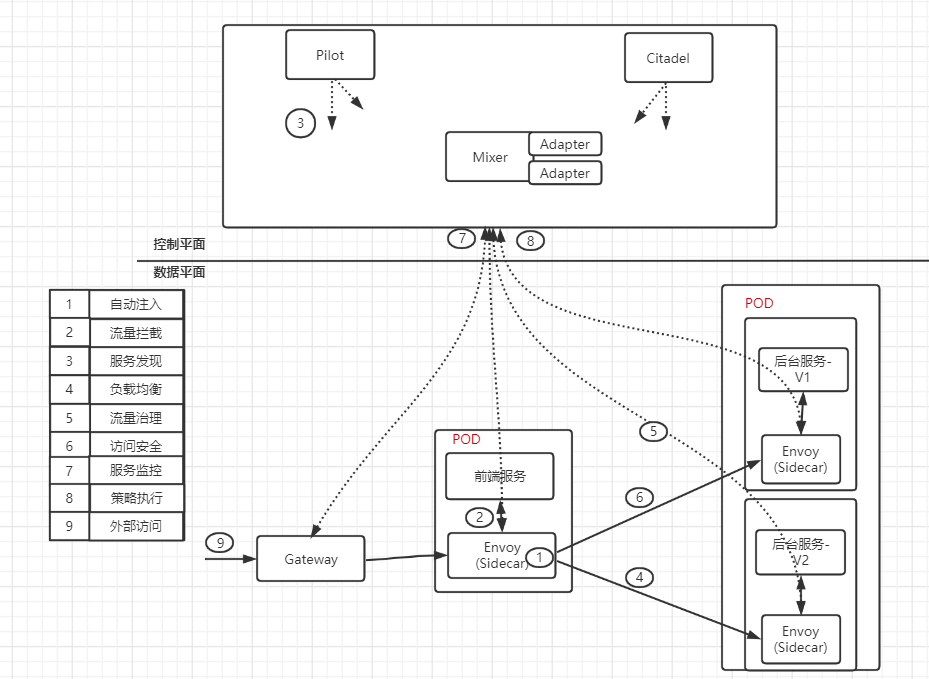
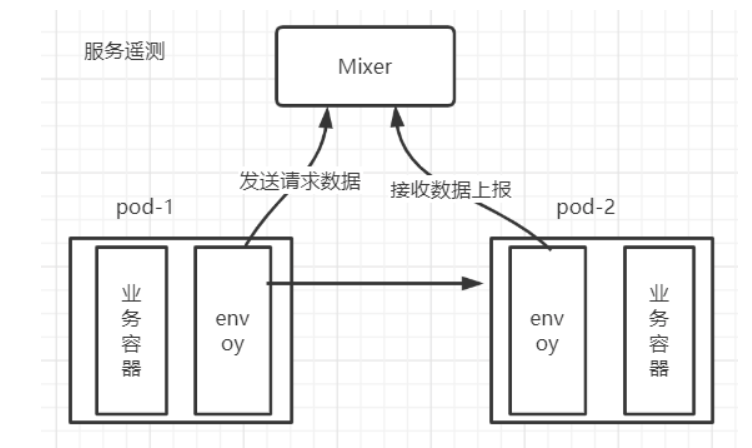
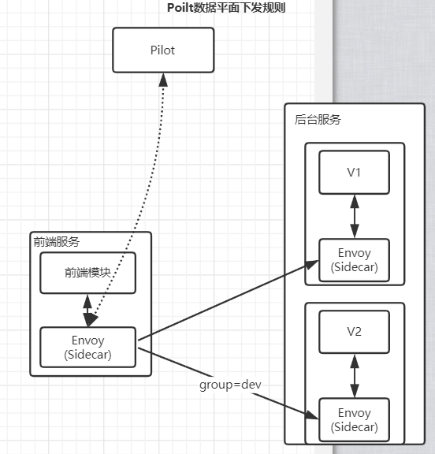
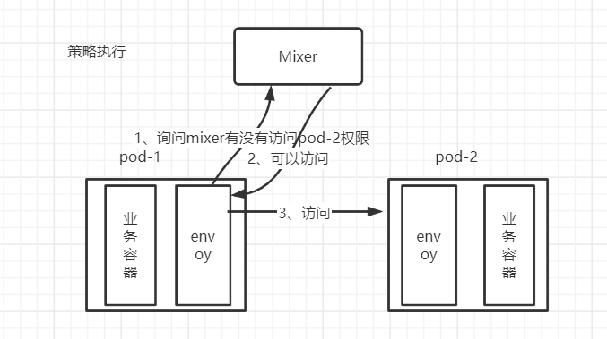
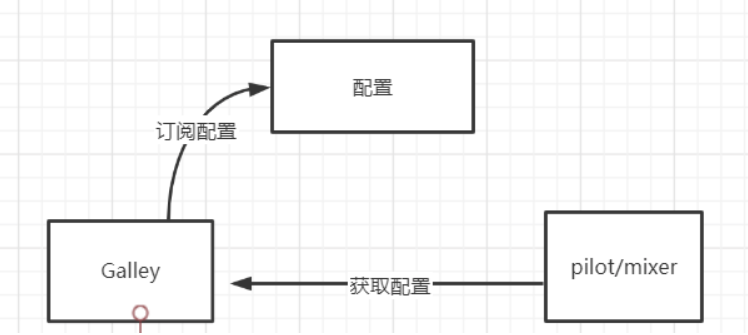
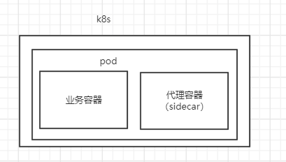
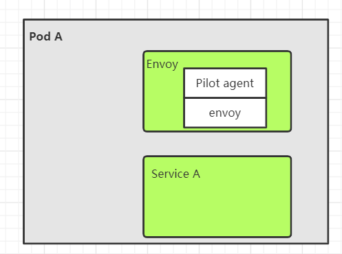
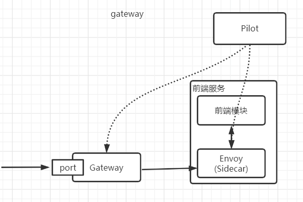
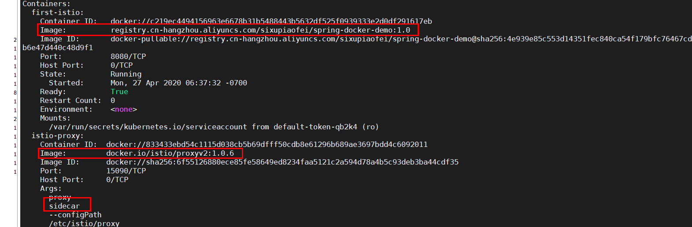

# 01 Istio 架构 

~~~
Istio的架构，分为控制平面和数据面平两部分。
- 数据平面：由一组智能代理（[Envoy]）组成，被部署为 sidecar。这些代理通过一个通用的策略和遥测中心传递和控制微服务之间的所有网络通信。
- 控制平面：管理并配置代理来进行流量路由。此外，控制平面配置 Mixer 来执行策略和收集遥测数据。
~~~

**下图展示了组成每个平面的不同组件：**



> ~~~
> 架构图可以看到，主要分为两个平面，控制面主要包括Istio的一些组件，例如：Pilot、Mixer、Citadel等服务组件；数据面由伴随每个应用程序部署的代理程序Envoy组成，执行针对应用程序的治理逻辑。为了避免静态、刻板地描述组件，在介绍组件的功能前，我们先通过一个动态场景来了解图架构图中对象的工作机制，即观察前端服务对后台服务进行一次访问时，在 Istio 内部都发生了什么，以及 Istio 的各个组件是怎样参与其中的，分别做了哪些事情。
> ~~~
>
> > 先简单理解
> >
> > Pilot：提供服务发现功能和路由规则
> >
> > Mixer：策略控制，比如：服务调用速率限制
> >
> > Citadel：起到安全作用，比如：服务跟服务通信的加密
> >
> > Sidecar/Envoy: 代理，处理服务的流量
>
> ~~~
> 架构图上带圆圈的数字代表在数据面上执行的若干重要动作。虽然从时序上来讲，控制面的配置在前，数据面执行在后，但为了便于理解，在下面介绍这些动作时以数据面上的数据流为入口，介绍数据面的功能，然后讲解涉及的控制面如何提供对应的支持，进而理解控制面上组件的对应功能。
> ~~~
>
> 
>
> （1）**自动注入**：（由架构图得知前端服务跟后端服务都有envoy,我们这里以前端服务envoy为例说明）指在创建应用程序时自动注入 Sidecar代理。那什么情况下会自动注入你？在 Kubernetes场景下创建 Pod时，Kube-apiserver调用管理平面组件的 Sidecar-Injector服务，然后会自动修改应用程序的描述信息并注入Sidecar。在真正创建Pod时，在创建业务容器的同时在Pod中创建Sidecar容器。
>
> ```yaml
> # 原始的yaml文件
> apiVersion: apps/v1
> kind: Deployment
> spec: 
> 	containers: 
> 	- name: nginx  
> 		image: nginx  
> 		...省略
> ```
>
> **调用Sidecar-Injector服务之后，yaml文件会发生改变**
>
> ```yaml
> # 原始的yaml文件
> apiVersion: apps/v1
> kind: Deployment
> spec: 
> 	containers: 
> 	- name: nginx  
> 		image: nginx  
> 		...省略
> # 增加一个容器image地址		
> 	containers: 
> 	- name: sidecar  
> 		image: sidecar  
> 		...省略	
> ```
>
> 
>
> 总结：会在pod里面自动生产一个代理，业务服务无感知
>
> （2）**流量拦截**：在 Pod 初始化时设置 iptables 规则，当有流量到来时，基于配置的iptables规则拦截业务容器的入口流量和出口流量到Sidecar上。但是我们的应用程序感知不到Sidecar的存在，还以原本的方式进行互相访问。在架构图中，流出前端服务的流量会被 前端服务侧的 Envoy拦截，而当流量到达后台服务时，入口流量被后台服务V1/V2版本的Envoy拦截。
>
> 
>
> 总结：每个pod中都会有一个代理来来拦截所有的服务流量（不管是入口流量还是出口流量）
>
> （3）**服务发现**：前端服务怎么知道后端服务的服务信息呢？这个时候就需要服务发现了，所以服务发起方的 Envoy 调用控制面组件 Pilot 的服务发现接口获取目标服务的实例列表。在架构图中，前端服务内的 Envoy 通过 控制平面Pilot 的服务发现接口得到后台服务各个实例的地址，为访问做准备。
>
> 总结：Pilot提供了服务发现功能，调用方需要到Pilot组件获取提供者服务信息
>
> （4）**负载均衡**：数据面的各个Envoy从Pilot中获取后台服务的负载均衡衡配置，并执行负载均衡动作，服务发起方的Envoy（前端服务envoy）根据配置的负载均衡策略选择服务实例，并连接对应的实例地址。
>
> 总结：Pilot也提供了负载均衡功能，调用方根据配置的负载均衡策略选择服务实例
>
> （5）**流量治理**：Envoy 从 Pilot 中获取配置的流量规则，在拦截到 入口 流量和出口 流量时执行治理逻辑。比如说，在架构图中，前端服务的 Envoy 从 Pilot 中获取流量治理规则，并根据该流量治理规则将不同特征的流量分发到后台服务的v1或v2版本。当然，这只是Istio流量治理的一个场景，Istio支持更丰富的流量治理能力。
>
> 
>
> 总结：Pilot也提供了路由转发规则
>
> （6）**访问安全**：在服务间访问时通过双方的Envoy进行双向认证和通道加密，并基于服务的身份进行授权管理。在架构图中，Pilot下发安全相关配置，在前端模块服务和后端服务的Envoy上自动加载证书和密钥来实现双向认证，其中的证书和密钥由另一个控制平面组件Citadel维护。
>
> 总结：Citadel维护了服务代理通信需要的证书和密钥
>
> （7）**服务遥测**：在服务间通信时，通信双方的Envoy都会连接控制平面组件Mixer上报访问数据，并通过Mixer将数据转发给对应的监控后端。比如说，在架构图中，前端模块服务对后端服务的访问监控指标、日志和调用链都可以通过Mixer收集到对应的监控后端。
>
> 
>
> 总结：Mixer组件可以收集各个服务上的日志，从而可以进行监控
>
> （8）**策略执行**：在进行服务访问时，通过Mixer连接后端服务来控制服务间的访问，判断对访问是放行还是拒绝。在架构图中，数据面在转发服务的请求前调用Mixer接口检查是否允许访问，Mixer 会做对应检查，给代理（Envoy）返回允许访问还是拒绝, 比如：可以对前端模块服务到后台服务的访问进行速率控制。
>
> 
>
> 总结：Mixer组件可以对服务速率进行控制（也就是限流）
>
> （9）**外部访问**：在架构图中，外部服务通过Gateway访问入口将流量转发到服务前端服务内的Envoy组件，对前端服务的负载均衡和一些流量治理策略都在这个Gateway上执行。
>
> **总结：**这里总结在以上过程中涉及的动作和动作主体，可以将其中的每个过程都抽象成一句话：服务调用双方的Envoy代理拦截流量，并根据控制平面的相关配置执行相应的服务治理动作，这也是Istio的数据平面和控制平面的配合方式。

# 02 Istio组件介绍

## 2.1 Pilot

**Pilot在Istio架构中必须要有**

> **思考:** 为什么Envoy能够服务发现？并且Envoy为什么可以流量控制？
>
> 就是因为Pilot存在

**什么是Pilot**

~~~
Pilot类似传统C/S架构中的服务端Master，下发指令控制客户端完成业务功能。和传统的微服务架构对比，Pilot 至少涵盖服务注册中心和向数据平面下发规则 等管理组件的功能。
~~~

**服务注册中心**

~~~
如图下图所示，Pilot 为 Envoy sidecar 提供服务发现、用于智能路由的流量管理功能（例如，A/B 测试、金丝雀发布等）以及弹性功能（超时、重试、熔断器等）。

Pilot本身不做服务注册，它会提供一个API接口，对接已有的服务注册系统，比如Eureka，Etcd等。
说白了，Pilot可以看成它是Sidecar的一个领导
~~~


> (1)Platform Adapter是Pilot抽象模型的实现版本，用于对接外部的不同平台
> (2)Polit定了一个抽象模型(Abstract model)，处理Platform Adapter对接外部不同的平台， 从特定平台细节中解耦
> (3)Envoy API负责和Envoy的通讯，主要是发送服务发现信息和流量控制规则给Envoy 
>
> **流程总结：** service服务C会注册到Pilot注册中心平台适配器(Platform Adapter)模块上（假如对接的是Eureka, 那么service服务C会注册到Eureka里面），然后抽象模型(Abstract model)进行平台细节的解耦并且用于处理Platform Adapter对接外部的不同平台，最后通过Envoy API负责和Envoy的通讯，主要是发送服务发现信息和流量控制规则给Envoy  

**数据平面下发规则**

~~~
Pilot 更重要的一个功能是向数据平面下发规则，Pilot 负责将各种规则转换换成 Envoy 可识别的格式，通过标准的 协议发送给 Envoy，指导Envoy完成动作。在通信上，Envoy通过gRPC流式订阅Pilot的配置资源。
~~~

~~~
Pilot将表达的路由规则分发到 Evnoy上，Envoy根据该路由规则进行流量转发，配置规则和流程图如下所示。
~~~

**规则如下：**

~~~yaml
# http请求
http:
-match: # 匹配
 -header: # 头部
   cookie:
   # 以下cookie中包含group=dev则流量转发到v2版本中
    exact: "group=dev"
  route:  # 路由
  -destination:
    name: v2
  -route:
   -destination:
     name: v1 
~~~



## 2.2 Mixer

**Mixer在Istio架构中不是必须的**

~~~
Mixer分为Policy和Telemetry两个子模块，Policy用于向Envoy提供准入策略控制，黑白名单控制，速率限制等相关策略；Telemetry为Envoy提供了数据上报和日志搜集服务，以用于监控告警和日志查询。
~~~

**Telemetry介绍**

> Mixer是一个平台无关的组件。Mixer的Telemetry 在整个服务网格中执行访问控制和策略使用，并从 Envoy 代理和其他服务收集遥测数据，流程如下图所示。


> - 遥测报告上报，比如从Envoy中收集数据[请求数据、使用时间、使用的协议等]，通过Adapater上 
> 
> 报给Promethues、Heapster等 
>
> 说白了，就是数据收集，然后通过adapter上传到监控容器里面

**policy介绍**

~~~
policy是另外一个Mixer服务，和istio-telemetry基本上是完全相同的机制和流程。数据面在转发服务的请求前调用istio-policy的Check接口是否允许访问，Mixer 根据配置将请求转发到对应的 Adapter 做对应检查，给代理返回允许访问还是拒绝。可以对接如配额、授权、黑白名单等不同的控制后端，对服务间的访问进行可扩展的控制。
~~~



> - 策略控制：检查请求释放可以运行访问 

## 2.3 Citadel

**Citadel在Istio架构中不是必须的**

>Istio的认证授权机制主要是由Citadel完成，同时需要和其它组件一起配合，参与到其中的组件还有Pilot、Envoy、Mixer，它们四者在整个流程中的作用分别为：
>
>- Citadel：用于负责密钥和证书的管理，在创建服务时会将密钥及证书下发至对应的Envoy代理中；
>- Pilot: 用于接收用户定义的安全策略并将其整理下发至服务旁的Envoy代理中；
>- Envoy：用于存储Citadel下发的密钥和证书，保障服务间的数据传输安全；
>- Mixer: 负责核心功能为前置条件检查和遥测报告上报;
>
>**流程如下**


> 具体工作流程可描述如下：
>
> - Kubernetes某集群节点新部署了服务Service，此时集群中有两个Pod被启动，每个Pod由Envoy代理容器和Service容器构成，在启动过程中Istio的Citadel组件会将密钥及证书依次下发至每个Pod中的Envoy代理容器中，以保证后续服务A，B之间的安全通信。
> - 用户通过Rules API下发安全策略至Pilot组件，Pilot组件通过Pilot-discovery进程整理安全策略中Kubernetes服务注册和配置信息并以Envoy API方式暴露给Envoy。
> - Pod 中的Envoy代理会通过Envoy API方式定时去Pilot拉取安全策略配置信息，并将信息保存至Envoy代理容器中。
> - 当pod内的服务相互调用时，会调用各自Envoy容器中的证书及密钥实现服务间的通信，同时Envoy容器还会根据用户下发的安全策略进行更细粒度的访问控制。
> - Mixer在整个工作流中核心功能为前置条件检查和遥测报告上报，在每次请求进出服务时，服务中的Envoy代理会向Mixer发送check请求，检查是否满足一些前提条件，比如ACL检查，白名单检查，日志检查等，如果前置条件检查通过，处理完后再通过Envoy向Mixer上报日志，监控等数据，从而完成审计工作。
>
> **使用场景：**
>
> >  在有一些场景中，对于安全要求是非常高的，比如支付，所以Citadel就是用来保证安全的。
>
> ~~~
> 回顾kubernetes API Server的功能：
> 
> * 提供了集群管理的REST API接口(包括认证授权、数据校验以及集群状态变更)；
> * 提供其他模块之间的数据交互和通信的枢纽（其他模块通过API Server查询或修改数据，只有API Server才直接操作etcd）;
> * 资源配额控制的入口；
> * 拥有完备的集群安全机制.
> ~~~

> **总结：**
>
> 用于负责密钥和证书的管理，在创建服务时会将密钥及证书下发至对应的Envoy代理中

## 2.4 Galley

**Galley在istio架构中不是必须的**

> Galley在控制面上向其他组件提供支持。Galley作为负责配置管理的组件，并将这些配置信息提供给管理面的 Pilot和 Mixer服务使用，这样其他管理面组件只用和 Galley打交道，从而与底层平台解耦。
>
> 
>
> **galley优点**
>
> - 配置统一管理，配置问题统一由galley负责
> - 如果是相关的配置，可以增加复用
> - 配置跟配置是相互隔离而且，而且配置也是权限控制，比如组件只能访问自己的私有配置
>
> 
>
> **MCP协议**
>
> > Galley负责控制平面的配置分发主要依托于一一种协议，这个协议叫（MCP）
>
> MCP提供了一套配置订阅和分发的API，里面会包含这个几个角色：
>
> - source: 配置的提供端，在istio中Galley即是source 说白了就是Galley组件，它提供yaml配置
> - sink:配置的消费端，istio组件中Pilot和Mixer都属于sink
> - resource: source和sink关注的资源体，也就是yaml配置
>
> 

~~~
Galley 代表其他的 Istio 控制平面组件，用来验证用户编写的 Istio API 配置。Galley 接管 Istio 获取配置、 处理和分配组件的顶级责任。它将负责将其他的 Istio 组件与从底层平台（例如 Kubernetes）获取用户配置的细节中隔离开来。
说白了：这样其他控制平面（Pilot和 Mixer）面组件只用和 Galley打交道，从而与底层平台解耦。
~~~


## 2.5 Sidecar-injector

>Sidecar-injector 是负责自动注入的组件，只要开启了自动注入，那么在创建pod的时候就会自动调用Sidecar-injector 服务
>
>配置参数：istio-injection=enabled，我们后面会有案例演示
>
>**在istio中sidecar注入有两种方式**
>
>- 需要使用istioctl命令手动注入   （不需要配置参数：istio-injection=enabled）
>- 基于kubernetes自动注入（配置参数：istio-injection=enabled）
>
>> 手动注入和自动注入会在istio安装之后案例演示
>>
>> 两种区别：
>>
>> 手动注入需要每次在执行配置都需要加上istioctl命令
>>
>> 自动注入只需要做一下开启参数即可
>
>**sidecar模式具有以下优势**
>
>- 把业务逻辑无关的功能抽取出来（比如通信），可以降低业务代码的复杂度
>- sidecar可以独立升级、部署，与业务代码解耦
>
>**注入流程**
>
>在 Kubernetes环境下，根据自动注入配置，Kube-apiserver在拦截到 Pod创建的请求时，会调用自动注入服务 istio-sidecar-injector 生成 Sidecar 容器的描述并将其插入原 Pod的定义中，这样，在创建的 Pod 内, 除了包括业务容器，还包括 Sidecar容器。这个注入过程对用户透明，用户使用原方式创建工作负载。
>
>

**总结：sidecar模式具有以下优势**

- 把业务逻辑无关的功能抽取出来（比如通信），可以降低业务代码的复杂度
- sidecar可以独立升级、部署，与业务代码解耦

## 2.6 Proxy(Envoy)

~~~
Proxy是Istio数据平面的轻量代理。
Envoy是用C++开发的非常有影响力的轻量级高性能开源服务代理。作为服务网格的数据面，Envoy提供了动态服务发现、负载均衡、TLS、HTTP/2 及 gRPC代理、熔断器、健康检查、流量拆分、灰度发布、故障注入等功能。
Envoy 代理是唯一与数据平面流量交互的 Istio 组件。
~~~

**Envoy组件解析**

为了便于理解Istio中Envoy与服务的关系，如图所示：



>一个pod里面运行了一个Envoy容器和service A容器，而Envoy容器内部包含了两个进程，分别是**Pilot-agent和Envoy**两个进程
>
>**pilot-agent**
>
>pilot-agent跟Envoy打包在同一个docker镜像里面
>
>- pilot-agent作用
>
>```
>* 生成envoy配置
>* 启动envoy
>* 监控envoy的运行状态，比如envoy出错是pilot-agent负责重启envoy,huozhe envoy配置变更之后reload envoy
>```
>
>**Envoy**
>
>负责拦截pod流量，负责从控制平面pilot组件获取配置和服务发现，上报数据给mixer组件
>
>

## 2.7 Ingressgateway 

~~~
ingressgateway 就是入口处的 Gateway，从网格外访问网格内的服务就是通过这个Gateway进行的。ingressgateway比较特别，是一个Loadbalancer类型的Service，不同于其他服务组件只有一两个端口，ingressgateway 开放了一组端口，这些就是网格内服务的外部访问端口。
网格入口网关ingressgateway和网格内的 Sidecar是同样的执行体，也和网格内的其他 Sidecar一样从 Pilot处接收流量规则并执行。因为入口处的流量都走这个服务。
~~~

**流程图如下**



> 由于gateway暴露了一个端口，外部的请求就可以根据这个端口把请求发给gateway了然后由gateway把请求分发给网格内部的pod上

## 2.8 其他组件

~~~
在Istio集群中一般还安装grafana、Prometheus、Tracing组件，这些组件提供了Istio的调用链、监控等功能，可以选择安装来完成完整的服务监控管理功能。
~~~

**总结**

~~~
主要介绍了一些常见的istio组件，其中有一些组件是istio默认就已经使用了，有一些组件我们后面也会来演示。
~~~

# 03 Istio安装

~~~
Istio支持在不同的平台下安装其控制平面，例如Kubernetes、Mesos和虚拟机等。
课程上以 Kubernetes 为基础讲解如何在集群中安装 Istio （Istio 1.0.6 要求Kubernetes的版本在1.11及以上）。
可以在本地或公有云上搭建Istio环境，也可以直接使用公有云平台上已经集成了Istio的托管服务。
~~~

## 3.1 在本地搭建Istio环境

### 3.1.1 Kubernetes集群环境

~~~
目前有许多软件提供了在本地搭建Kubernetes集群的能力，例如Minikube/kubeadm都可以搭建kubernetes集群，我这边所选用的是kubeadm来安装Kubernetes集群。
~~~

~~~
Kubeadm 是一个工具，它提供了 kubeadm init 以及 kubeadm join 这两个命令作为快速创建 kubernetes 集群的最佳实践。
~~~

**准备机器**

> 两台centos7的虚拟机，地址分别为
>
> 192.168.187.137
>
> 192.168.187.138

~~~
大家根据自己的情况来准备centos7的虚拟机。

虚拟机要保证彼此之间能够ping通，也就是处于同一个网络中。

Kubernets官网推荐虚拟机的配置最低要求：2核2G（这边建议最低2核3G配置）
~~~

**Docker环境**

~~~
在每一台机器上都安装好Docker，我这边使用的版本为18.09.0

# docker查看版本命令
  docker --version
~~~

**修改hosts文件**

> (1)设置master角色,在192.168.187.138打开hosts文件
>
> ~~~sh
> # 打开hosts文件
> vi /etc/hosts
> # 设置192.168.187.138为master的hostname,用m来表示
> 192.168.187.138 m
> # 设置192.168.187.137为worker的hostname,用w1来表示
> 192.168.187.137 w1
> ~~~
>
> (2)设置worker角色,在192.168.187.137打开hosts文件
>
> ~~~sh
> # 打开hosts文件
> vi /etc/hosts
> # 设置192.168.187.138为master的hostname,用m来表示
> 192.168.187.138 m
> # 设置192.168.187.137为worker的hostname,用w1来表示
> 192.168.187.137 w1
> ~~~
>
> (3)使用ping测试一下
>
> ping m
>
> ping w1

**kubeadm安装版本**

> 安装的版本是1.14.0

 **kubernetes集群网络插件-calico**

> calico网络插件：<https://docs.projectcalico.org/v3.9/getting-started/kubernetes/>
>
> `calico，同样在master节点上操作`
>
> ~~~
> Calico为容器和虚拟机工作负载提供一个安全的网络连接。
> ~~~
>

 **验证 Kubernetes安装**

> 1)在master节点上检查集群信息
>
> 命令：kubectl get nodes
>
> 2)监控 w1节点的状态 ：kubectl get nodes -w
>
> 监控成 ready状态
>
> 3)查询pod 命令：kubectl get pods -n kube-system

**注意：Kubernetes集群安装方式有很多，大家可以安装自己熟悉的方式搭建Kubernetes, 这里只是介绍本次课程上使用的kubernets集群环境**

### 3.1.2  安装Istio

> 在Istio的版本发布页面https://github.com/istio/istio/releases/tag/1.0.6下载安装包并解压（我用的是一个比较稳定的版本1.0.6版本，放到master上面，以Linux平台的istio-1.0.6-linux.tar.gz为例）
>
> 1.解压tar -xzf istio-1.0.6-linux.tar.gz
>
> 2.进入istio目录cd  istio-1.0.6/
>
> **Istio的安装目录及其说明**
>
> | 文件/文件夹   | 说明                                                         |
> | ------------- | ------------------------------------------------------------ |
> | bin           | 包含客户端工具,用于和Istio APIS交互                          |
> | install       | 包含了Consul和Kubernetes平台的Istio安装脚本和文件，在Kubernetes平台上分为YAML资源文件和Helm安装文件 |
> | istio.VERSION | 配置文件包含版本信息的环境变量                               |
> | samples       | 包含了官方文档中用到的各种应用实例如bookinfo/helloworld等等，这些示例可以帮助读者理解Istio的功能以及如何与Istio的各个组件进行交互 |
> | tools         | 包含用于性能测试和在本地机器上进行测试的脚本文件和工具       |

**有以下几种方式安装Istio：**

* 使用install/kubernetes文件夹中的istio-demo.yaml进行安装；
* 使用Helm template渲染出Istio的YAML安装文件进行安装；
* 使用Helm和Tiller方式进行安装。

> 课程中使用的是使用install/kubernetes文件夹中的istio-demo.yaml进行安装

#### 3.1.2.1 快速部署Istio

**Kubernetes CRD介绍**

> 比如Deployment/Service/etc等资源是kubernetes本身就支持的类型，除了这些类型之外kubernetes还支持资源的扩展，说白了就是可以自定义资源类型，如果没有CRD的支持的话，istio一些资源类型是创建不成功的

~~~sh
#crds.yaml路径：
istio-1.0.6/install/kubernetes/helm/istio/templates/crds.yaml
# 执行
kubectl apply -f crds.yaml
# 统计个数
kubectl get crd -n istio-system | wc -l
~~~

> Kubernetes平台对于分布式服务部署的很多重要的模块都有系统性的支持，借助如下一些平台资源可以满足大多数 分布式系统部署和管理的需求,但是在不同应用业务环境下，对于平台可能有一些特殊的需求，这些需求可以抽象为Kubernetes的扩展资源，而 Kubernetes的CRD(CustomResourceDefifinition)为这样的需求提供了轻量级的机制

**执行安装命令**

> (1)根据istio-1.0.6/install/kubernetes/istio-demo.yaml创建资源
>
> ~~~sh
> kubectl apply -f istio-demo.yaml
> # 会发现有这么多的资源被创建了，很多很多	，里面的命名空间用的是istio-system
> ~~~
>
> 2)查看核心组件资源
>
> ~~~sh
> kubectl get pods -n istio-system 
> kubectl get svc -n istio-system 
> ~~~
>
> 
>
> > 可以看到有3个是completed，其它的组件都必须是running,  completed表示的是用的是k8s里面JOB资源，表示这个任务已经执行结束了
> >
> > 可以看到比如citadel有了，pilot有了，sidecar也有了，其它的比如ingress网关都有了，监控也有了

#### 3.1.2.2 **回顾K8S组件以及使用**

> 回顾课程涉及到的kubernetes组件

##### **Deployment**

> ```
> 一旦运行了 Kubernetes 集群，就可以在其上部署容器化应用程序。 为此，需要创建 Kubernetes Deployment 配置。
> Deployment 负责 Kubernetes 如何创建和更新应用程序的实例。
> 创建 Deployment 后，Kubernetes master 将应用程序实例调度到集群中的各个节点上。
> ```
>
> **创建nginx_deployment.yaml文件**
>
> ```yaml
> apiVersion: apps/v1 ## 定义了一个版本
> kind: Deployment ##k8s资源类型是Deployment
> metadata: ## metadata这个KEY对应的值为一个Maps
>   name: nginx-deployment ##资源名字 nginx-deployment
>   labels: ##将新建的Pod附加Label
>     app: nginx ##一个键值对为key=app,valuen=ginx的Label。
> spec: #以下其实就是replicaSet的配置
>   replicas: 3 ##副本数为3个，也就是有3个pod
>   selector: ##匹配具有同一个label属性的pod标签
>     matchLabels: ##寻找合适的label，一个键值对为key=app,value=nginx的Labe
>       app: nginx
>   template: #模板
>     metadata:
>       labels: ##将新建的Pod附加Label
>         app: nginx
>     spec:
>       containers:  ##定义容器
>       - name: nginx ##容器名称
>         image: nginx:1.7.9 ##镜像地址
>         ports:
>         - containerPort: 80 ##容器端口
> ```
>
> (1)执行资源文件命令
>
> ~~~
> kubectl apply -f nginx_deployment.yaml
> ~~~
>
> (2)查看pod
>
> ```
> kubectl get pods
> 查看pod详情
> kubectl get pods -o wide
> ```
>
> (3)查看deployment命令
>
> ```
> kubectl get deployment
> ```
>
> (4)查看deployment详情命令
>
> ```
> kubectl get deployment -o wide
> ```

##### Labels and Selectors

> ```
> 顾名思义，就是给一些资源打上标签的
> ```
>
> **labels**
>
> > 当资源很多的时候可以用可以用labels标签来对资源分类
>
> ~~~yaml
> apiVersion: v1
> kind: Pod
> metadata:
>   name: nginx-pod
>   labels:
>     app: nginx
>  
>  # 表示名称为nginx-pod的pod，有一个label，key为app，value为nginx。
>  #我们可以将具有同一个label的pod，交给selector管理
> ~~~
>
> **selectors**
>
> > 如果我想使用这个标签里面的k8s资源，那么需要用到k8s里面selector组件，用selector来匹配到特定的的label
>
> ~~~yaml
> apiVersion: apps/v1
> kind: Deployment
> metadata: 
>   name: nginx-deployment
>   labels:  # 定义了一个labels,key=app,value=nginx
>     app: nginx
> spec:
>   replicas: 3
>   selector:             # 用selector匹配具有同一个label属性的pod标签
>     matchLabels:
>       app: nginx         
> ~~~
>
> > 查看pod的label标签命令：
> >
> > ~~~
> > kubectl get pods --show-labels
> > ~~~
> >
> > 

##### Namespace

> ```
> 命名空间就是为了隔离不同的资源。比如：Pod、Service、Deployment等。可以在输入命令的时候指定命名空间`-n`，如果不指定，则使用默认的命名空间：default。
> ```
>
> 查看一下当前的所用命名空间：`kubectl get namespaces/ns`
>
> 查看一下kube-system命名空间：`kubectl get pods -n kube-system`
>
> > (1)创建自己的namespace
> >
> > > my-namespace.yaml
> > >
> > > ```yaml
> > > apiVersion: v1
> > > kind: Namespace
> > > metadata:
> > >     name: myns
> > > ```
> >
> > (2)执行命令：kubectl apply -f my-namespace.yaml 
> >
> > (3)查看命令
> >
> > ```
> > kubectl get ns
> > ```
>
> > 删除命名空间
> >
> > kubectl delete namespaces 空间的名字
> >
> > ```
> > 注意：
> > 删除一个namespace会自动删除所有属于该namespace的资源。
> > default和kube-system命名空间不可删除。
> > ```

##### Service

###### 集群内部访问方式（ClusterIP）

> ```
> Pod虽然实现了集群内部互相通信，但是Pod是不稳定的，比如通过Deployment管理Pod，随时可能对Pod进行扩缩容，这时候Pod的IP地址是变化的。能够有一个固定的IP，使得集群内能够访问。也就是之前在架构描述的时候所提到的，能够把相同或者具有关联的Pod，打上Label，组成Service。而Service有固定的IP，不管Pod怎么创建和销毁，都可以通过Service的IP进行访问
> 
> k8s用service来解决这个问题，因为service会对应一个不会的ip，然后内部通过负载均衡到相同label上的不同pod机器上
> ```
>
> > (1)创建whoami-deployment.yaml文件
>
> ```yaml
> apiVersion: apps/v1 ## 定义了一个版本
> kind: Deployment ##资源类型是Deployment
> metadata: ## metadata这个KEY对应的值为一个Maps
>   name: whoami-deployment ##资源名字
>   labels: ##将新建的Pod附加Label
>     app: whoami ##key=app:value=whoami
> spec: ##资源它描述了对象的
>   replicas: 3 ##副本数为1个，只会有一个pod
>   selector: ##匹配具有同一个label属性的pod标签
>     matchLabels: ##匹配合适的label
>       app: whoami
>   template: ##template其实就是对Pod对象的定义  (模板)
>     metadata:
>       labels:
>         app: whoami
>     spec:
>       containers:
>       - name: whoami ##容器名字  下面容器的镜像
>         image: jwilder/whoami
>         ports:
>         - containerPort: 8000 ##容器的端口
> 
> ```
>
> > jwilder/whoami这是一个可以在docker仓库里面拉取到的镜像，是官方提供的一个演示的镜像
>
> (1)执行命令
>
> ```
> kubectl apply -f whoami-deployment.yaml
> ```
>
> (2)查看详情
>
> ```
> kubectl get pods -o wide
> ```
>
> > (3)在集群内正常访问
>
> ```
> curl 192.168.221.80:8000/192.168.14.6:8000/192.168.14.7:8000
> ```
>
> > (5)测试：删除其中一个pod，查看重新生成的ip有没有变化
>
> ```
> kubectl delete pod  whoami-deployment-678b64444d-jdv49
> ```
>
> > 新加的pod地址发生了变化
>
> (6) Service 登场
>
> 查询svc命名空间下的资源
>
> ```
> kubectl get svc
> ```
>
> > (7)创建自己的service空间
> >
> > ```
> > 创建：kubectl expose deployment deployment名字
> > 例如：kubectl expose deployment whoami-deployment
> > ```
> >
> > (8)重新查询service空间，会发现有一个whoami-deployment的service，ip为10.107.4.74
> >
> > ```
> > [root@m k8s]# kubectl get svc
> > NAME                TYPE        CLUSTER-IP    EXTERNAL-IP   PORT(S)    AGE
> > kubernetes          ClusterIP   10.96.0.1     <none>        443/TCP    2d12h
> > whoami-deployment   ClusterIP   10.107.4.74   <none>        8000/TCP   3s
> > 
> > ```
> >
> > (9)访问service：curl 10.107.4.74:8000
> >
> > 多试几次会发现service会负载到其中的一个pod上
> >
> > (10)查看service
> >
> > ```
> > kubectl describe svc service名字 
> > 例如：kubectl describe svc whoami-deployment
> > ```
> >
> > ```
> > [root@m k8s]# kubectl describe svc whoami-deployment
> > Name:              whoami-deployment
> > Namespace:         default
> > Labels:            app=whoami
> > Annotations:       <none>
> > Selector:          app=whoami
> > Type:              ClusterIP
> > IP:                10.107.4.74
> > Port:              <unset>  8000/TCP
> > TargetPort:        8000/TCP
> > Endpoints:         192.168.190.86:8000,192.168.190.87:8000,192.168.190.89:8000
> > Session Affinity:  None
> > Events:            <none>
> > # 说白了 service下面挂在了Endpoints节点
> > ```
> >
> > (11)将原来的节点扩容到5个
> >
> > ```
> > kubectl scale deployment whoami-deployment --replicas=5
> > ```
> >
> > (12)删除service命令
> >
> > ```
> >kubectl delete service service名字 
> > kubectl delete service whoami-deployment
> > ```
> > 
> > **总结**：其实Service存在的意义就是为了Pod的不稳定性，而上述探讨的就是关于Service的一种类型Cluster IP
>

###### 外部服务访问集群中的Pod(NodePort)

>也是Service的一种类型，可以通过NodePort的方式
>
>说白了，因为外部能够访问到集群的物理机器IP，所以就是在集群中每台物理机器上暴露一个相同的端口锁，比如32008
>
>

**操作**

> （1）先删除之前的service
>
> ```
> kubectl delete svc whoami-deployment
> ```
>
> （2）再次查看命令
>
> ```
> kubectl get svc
> 发现whoami-deployment已被删除
> ```
>
> （3）查看pod命令
>
> ~~~
> kubectl get pods 
> ~~~
>
> （4）创建type为NodePort的service
>
> ```
> kubectl expose deployment whoami-deployment --type=NodePort
> ```
>
> 查看：kubectl get svc
>
> 

> > 并且生成了一个port端口，会有一个8000端口映射成宿主机的31504端口
> >
> > 注意上述的端口31504，实际上就是暴露在集群中物理机器上的端口
> >
> > ```
> > lsof -i tcp:31504
> > netstat -ntlp|grep 31504
> > ```
> >
> > > 浏览器通过物理机器的IP访问
> >
> > ```
> > http://192.168.187.137:31504/
> > curl 192.168.187.137:31504/
> > ```
> >
> > > NodePort虽然能够实现外部访问Pod的需求，但是需要占用了各个物理主机上的端口
> > >
> > > 删除资源
> >
> > ```
> > kubectl delete -f whoami-deployment.yaml
> > kubectl delete svc whoami-deployment
> > ```


##### Ingress

> 前面我们也学习可以通过service nodeport方式实现外部访问Pod的需求，但是会占用了各个物理主机上的端口，所以 这种方式不好
>
> > 删除资源
> >
> > ```
> > # 删除pod 
> > kubectl delete -f whoami-deployment.yaml
> > # 删除service
> > kubectl delete svc whoami-deployment
> > ```

> 那接下来还是基于外部访问内部集群的需求，使用Ingress实现访问whoami需求。
>
> （1）创建whoami-service.yaml文件
>
> > 创建pod和service
>
> ~~~yaml
> apiVersion: apps/v1 ## 定义了一个版本
> kind: Deployment ##资源类型是Deployment
> metadata: ## metadata这个KEY对应的值为一个Maps
>   name: whoami-deployment ##资源名字
>   labels: ##将新建的Pod附加Label
>     app: whoami ##key=app:value=whoami
> spec: ##资源它描述了对象的
>   replicas: 3 ##副本数为1个，只会有一个pod
>   selector: ##匹配具有同一个label属性的pod标签
>     matchLabels: ##匹配合适的label
>       app: whoami
>   template: ##template其实就是对Pod对象的定义  (模板)
>     metadata:
>       labels:
>         app: whoami
>     spec:
>       containers:
>       - name: whoami ##容器名字  下面容器的镜像
>         image: jwilder/whoami
>         ports:
>         - containerPort: 8000 ##容器的端口
> ---
> apiVersion: v1
> kind: Service
> metadata:
>   name: whoami-service
> spec:
>   ports:
>   - port: 80
>     protocol: TCP
>     targetPort: 8000
>   selector:
>     app: whoami
> 
> ~~~
>
> （2）执行资源命令
>
> ~~~sh
> kubectl apply -f whoami-service.yaml
> ~~~
>
> （3）创建whoami-ingress.yaml文件
>
> ```yaml
> apiVersion: extensions/v1beta1
> kind: Ingress # 资源类型
> metadata:
>   name: whoami-ingress # 资源名称
> spec:
>   rules: # 定义规则
>   - host: whoami.qy.com  # 定义访问域名
>     http:
>       paths:
>       - path: / # 定义路径规则，/ 表示能够命中任何路径规则
>         backend:
>           serviceName: whoami-service  # 把请求转发给service资源，这个service就是我们前面运行的service
>           servicePort: 80 # service的端口
> ```
>
> （4）执行命令：
>
> ~~~
> kubectl apply -f  whoami-ingress.yaml
> ~~~
>
> （5）、查看ingress资源：
>
> ~~~
> kubectl get ingress
> ~~~
>
> （6）查看ingress资源详细：
>
> ~~~
> kubectl describe ingress whoami-ingress
> ~~~
>
> （7）、修改win的hosts文件，添加dns解析
>
> ```
> 192.168.187.137 whoami.qy.com
> ```
>
> （8）、打开浏览器，访问whoami.qy.com

**流程总结**


> 浏览器发送请求给ingress,ingress根据规则配置把请求转发给对应的service，由于service配置了pod，所以请求最终发给了pod内对应的服务

**总结**

ingress转发请求更加灵活，而且不需要占用物理机的端口，所以建议使用这种方式转发外部请求到集群内部

#### 3.1.2.3 初步感受istio

> 在docker中是通过container来部署业务的，在k8s里面是通过pod来部署业务的，那么在istio里面如何体现sidecar呢？
>
> `猜想：`会不会在pod中除了业务需要的container之外还会有一个sidecar的container存在呢？
>
> 验证猜想
>
> （1）准备一个资源 first-istio.yaml
>
> ~~~yaml
> apiVersion: apps/v1 ## 定义了一个版本
> kind: Deployment ##资源类型是Deployment
> metadata:
>     name: first-istio 
> spec:
>     selector:
>        matchLabels:
>          app: first-istio
>     replicas: 1
>     template:
>        metadata:
>          labels:
>            app: first-istio
>        spec:
>          containers:
>       - name: first-istio ##容器名字  下面容器的镜像
>            image: registry.cn-hangzhou.aliyuncs.com/sixupiaofei/spring-docker-demo:1.0
>            ports:
>         - containerPort: 8080 ##容器的端口
> ---
> apiVersion: v1
> kind: Service ##资源类型是Service
> metadata:
>     name: first-istio ##资源名字first-istio
> spec:
>     ports:
>   - port: 80 ##对外暴露80
>        protocol: TCP ##tcp协议
>        targetPort: 8080 ##重定向到8080端口
>     selector:
>        app: first-istio ##匹配合适的label，也就是找到合适pod
>     type: ClusterIP ## Service类型ClusterIP
> ~~~
> 
>创建文件夹istio,然后把first-istio放进去，按照正常的创建流程里面只会有自己私有的containers,不会有sidecar
> 
>~~~sh
> #执行，会发现 只会有一个containers在运行
> kubectl apply -f first-istio.yaml
> #查看first-isitio service
> kubectl get svc
> # 查看pod的具体的日志信息命令
> kubectl describe pod first-istio-8655f4dcc6-dpkzh
> #删除
> kubectl delete -f first-istio.yaml
> ~~~

> 查看pod命令
>
> ~~~
> kubectl get pods
> ~~~


**思考：怎么让pod里面自动增加一个Sidecar呢？**

> 有两种方式：手动注入和自动注入

#### 3.1.2.4 手动注入

（1）删除上述资源，重新创建，使用手动注入sidecar的方式 

~~~sh
istioctl kube-inject -f first-istio.yaml | kubectl apply -f -
~~~

> **注意：**istioctl 命令需要先在/etc/profile配置PATH
>
> *  vim /etc/profile
>
> * 增加isito安装目录配置
>
> ~~~
> export ISTIO_HOME=/home/tools/istio-1.0.6
> export PATH=$PATH:$ISTIO_HOME/bin
> ~~~
>
> * 加载profile文件 
>
> ~~~
> source profile
> ~~~

（2）查看pod数量

~~~sh
kubectl get pods # 注意该pod中容器的数量 ，会发现容器的数量不同了，变成了2个
~~~


(3) 查看service

~~~sh
kubectl get svc
~~~

**思考：**

> 我的yaml文件里面只有一个container,执行完之后为什么会是两个呢？
>
> 我的猜想另外一个会不会是Sidecar,那么我描述一下这个pod,看看这两个容器到底是什么
>
> ~~~sh
> # 查看pod执行明细
> kubectl describe pod first-istio-75d4dfcbff-qhmxj
> ~~~
>
> 
>
> > 发现竟然除了我的容器之外还多了一个代理容器，此时我们大胆猜想这个代理会不会就是sidecar呢
>
> 接着往上翻
>
> 
>
> > 此时已经看到了我们需要的答案了
>
> **查看yaml文件内容**
>
> ~~~sh
> kubectl get pod first-istio-75d4dfcbff-qhmxj -o yaml
> ~~~
>
> 
>
> > **总结**
> >
> > 这个yaml文件已经不是我们原来的yaml文件了，会发现这个yaml文件还定义了一个proxy的image,这个image是我们提前就已经准备好了的,所以istio是通过改变yaml文件来实现注入一个代理

(4)删除资源

~~~sh
istioctl kube-inject -f first-istio.yaml | kubectl delete -f -
~~~

**思考：**难道我以后每次都要写那么一大串命令创建sidecar吗，有没有正常的命令来直接创建sidecar呢？

#### 3.1.2.5 自动注入sidecar

~~~
首先自动注入是需要跟命名空间挂钩，所以需要创建一个命名空间，只需要给命名空间开启自动注入，后面创建的资源只要挂载到这个命名空间下，那么这个命名空间下的所有的资源都会自动注入sidecar了
~~~

(1)创建命名空间

~~~sh
kubectl create namespace my-istio-ns
~~~

(2)给命名空间开启自动注入

~~~sh
kubectl label namespace my-istio-ns istio-injection=enabled
~~~

(3)创建资源,指定命名空间即可

~~~sh
# 查询  istio-demo命名空间下面是否存在资源
kubectl get pods -n my-istio-ns
# 在istio-demo命名空间创建资源
kubectl apply -f first-istio.yaml -n my-istio-ns
~~~

(4)查看资源

~~~sh
kubectl get pods -n my-istio-ns
~~~

(5)查看资源明细

~~~sh
kubectl describe pod pod-name -n my-istio-ns
~~~


> 发现除了我的容器之外依旧多了一个代理容器

(6)查看service

~~~sh
kubectl get svc -n my-istio-ns
~~~

(7)删除资源

~~~sh
kubectl delete -f first-istio.yaml -n my-istio-ns
~~~

> 大家应该都已经明白了istio怎么注入sidecar的了吧

**sidecar注入总结：**

> 不管是自动注入还是手动注入原理都是在yaml文件里面追加一个代理容器，这个代理容器就是sidecar,这里更推荐自动注入的方式来实现 sidecar 的注入

# 总结

这节课我们主要是讲解了istio的架构、组件，以及istio的安装，对istio有了进一步的了解，下节课我们会继续深入地学习istio，并开始istio案例实战